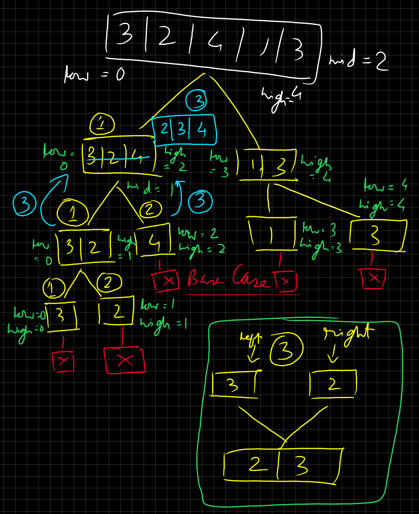

To clone this repository, run:

```bash
git clone https://github.com/sayande717/code.git
```

## TIL (Today I Learnt):
- `char *arr = (char *)malloc(sizeof(char)*cols)`: Dynamically allocate memory for a 1D array of size `cols`.
- `int **arr = (int **)malloc(sizeof(int *)*cols)`: Dynamically allocate memory for a 1D pointer array of size `cols`.
- `int *arr = (int *)calloc(cols,sizeof(int))`: Dynamically allocate memory for a 1D array of size `cols`, then fill all spaces with `0`.
- `(current + 1) % n` leads us to the next index, after current element.
- `(current + (n-1)) % n` leads us to the previous index, before current element.
- To find the number of digits in a number ie length of a number, use `len=log10(num)+1`.
- Language: `c`:
    - A string always ends with null character '\0'. So you can use this character to identify the end of a string.
        ```c 
        int strSize=0;
        for(int index=0;str[index]!='\0';index++) {
            printf("%c ",str[index]);
            strSize++;
        }

        printf("\nString length: %d",strSize);
        ```
    - `EXIT_SUCCESS` means 0 and `EXIT_FAILURE` means 1 in general context, in a program. They are a part of `<stdlib.h>`.
    - `exit(EXIT_FAILURE)` and `exit(EXIT_SUCCESS)` is used to indicate failed and succesful program termination.
    - `return EXIT_SUCCESS` and `return EXIT_FAILURE` can also be used in int main() { ... } or even in other programs.
    - `printf("%.Nf"): Print N characters after the decimel point`.
    - `string` operations
        - `atoi()`: Converts a string to an integer.
            - `"123456" -> 123456
            - `"123abc123" -> 123 (converts till 1st non-number character is encountered).
    - `srand(time(NULL))`: Seeds the random number generator with the current time in seconds since EPOCH.
    - `rand()` i.e. generate random number within num: `rand()%(num+1)`
    - `rand()` i.e. generate random number between low and high: `rand()%(high-low-1)+low`
    - To print multiple lines at once (ensure there's no space between `\` and `\n`):
        ```c
        printf("\nMemory Addresses: \
                \nOption 1: %d \
                \nOption 2: %d\
                \nOption 3: %d",opt1,opt2,opt3);
        ```
    - To calculate Execution time for a section of code:
        ```c
        #include<time.h>
        int main() {
            clock_t start, end;
            double time_used;

            start = clock();
            // Code Section
            end = clock();
            
            time_used = ((double)(end-start))/CLOCKS_PER_SEC;
            printf("Time Taken: %f",time_used);
        }
        ```
- To multiply 2 matrices:
    ```c
    for(iter0 = 0 to number of rows in Matrix 1, iter0++) {
        for(iter1 = 0 to number of columns in Matrix 2, iter1++) {
            for(iter2 = 0 to number of rows in Matrix 2, iter2++) {
                // outArr[i][k] += inArr[i][k] * inArr[k][j]
                outArr[iter0][iter1] = outArr[iter0][iter1] + (inArr1[iter0][iter2] * inArr2[iter2][iter1]);
            }
        }
    }
    ```
- To read from a file, which contains a `rows x cols` matrix:
```c
    void readText(char *filename, int **matrix, int rows, int cols) {
        FILE *file = fopen(filename, "r");
        if (file == NULL) {
            perror("Error opening file");
            exit(EXIT_FAILURE);
        }
    
        for (int row = 0; row < rows; row++) {
            for (int col = 0; col < cols; col++) {
                fscanf(file, "%d", &matrix[row][col]);
            }
        }

        fclose(file);
    }
```
- To write to a file, which contains a `rows x cols` matrix:
```c
    void writeText(char *filename, int **matrix, int rows, int cols) {
        FILE *file = fopen(filename, "w"); 
        if (file == NULL) {
            perror("Error opening file");
            exit(EXIT_FAILURE);
        }
    
        for (int row = 0; row < rows; row++) {
            for (int col = 0; col < cols; col++) {
                fprintf(file, "%d ", matrix[row][col]);
            }
            fprintf(file, "\n");
        }

        fclose(file);
    }
```
- File Opening modes:
    - “r”: Open a file for reading. The file must exist.
    - “w”: Open a file for writing. Creates a new file or truncates an existing file.
    - “a”: Open a file for appending. Writes data at the end of the file. Creates the file if it does not exist.
    - “r+”: Open a file for both reading and writing. The file must exist.
    - “w+”: Open a file for both reading and writing. Creates a new file or truncates an existing file.
    - “a+”: Open a file for both reading and appending. Creates the file if it does not exist.
- Language: `java`:
    - If input = `4 -2 3 1 6` & we're supposed to find the array length, and iterate over the integers:
        ```java
        String inputStr = "4 -2 3 1 6";
        String[] stringArr = inputStr.split(" "); // Split the string tokens into a character array, with " " as delimiter.
        stringArrLen = stringArr.length; // Length of the resultant string array.
        for(int index = 0;index++) {
            int temp = Integer.parseInt(stringArr[index]); // Convert from character to integer.
        }
        ```
    - This is how you catch the exception `NumberFormatException` when parsing a character to an integer:
        ```java
        String[] array = {'1','2','-1','a','z'};
        try {
            for(int index=0;index<array.length;index++) {
                int element = Integer.parseInt(array[index]);
            }
        } catch(Exception e) {
            System.out.print("Type of exception: "+e.getMessage);
            // return; if you don't want the code to continue to the next part.
        }
        ```
    - Functions:
        - `String str="abcdefgh`;
            - `str.substring(1)`: "bcdefgh";
            - `str.substring(1,4)`: "bcd";
        - `Integer.parseInt("1234")`: This function only accepts & converts strings, not characters.
        - `Character.getNumericValue('1')` -> (int), 1
    - A `HashSet` is a collection that does not allow duplicate elements. It only stores unique elements, and rejects everything else.
    - If the input: an integer in the line 1, a string in line 2
    - Input:
        ```text
        10
        str1 str2 str3 str4
        ```
    - ... and you take the inputs like:
        ```java
        Scanner in = new Scanner(System.in);

        int n = in.nextInt();
        String str = in.nextLine();

        in.close();
        ```
    - ... then, after reading the target integer with `nextInt()`, str's `nextLine()` call will consume the newline character (\n). This will result in the `newline()` not getting any input.
    - The solution to this is to use a dummy `in.nextLine()` to consume the newline character, so str's `nextLine()` starts accepting strings from the proper line.
    - Solution:
        ```java
        Scanner in = new Scanner(System.in);

        int n = in.nextInt();
        in.nextLine(); // Dummy call to consume newline (\n).
        String str = in.nextLine();

        in.close();
        ```
    - `HashMap`: A HashMap stores key:value pairs.
        ```java
        import java.util.HashMap;
        import java.util.Map;

        HashMap<Integer,Integer> freqMap = new HashMap<Integer,Integer>(); // Initialize a HashMap
        // Here, the key is the integer, and the value is it's frequency.
        freqMap.put(2,1);                                                  // Insert values
        freqMap.remove(2,1);                                               // Remove values
        // freqMap.getOrDefault() gets the value of a key 2 and returns it. If not found, it will return 0.
        freqMap.put(2, freqMap.getOrDefault(2, 0) + 1);
        
        // Iterate over keys in the HashMap
        for(int key : freqMap.keySet()) {
            int value =  freqMap.get(key);
        }

        // Iterate over both keys and values
        for (Map.Entry<String, Integer> entry : freqMap.entrySet()) {
            System.out.printf("Key: %d, Value: %d",entry.getKey(),entry.getValue());
            }
        }

        // freqMap.values() returns all values in the HashMap, which can then be stored in an ArrayList.
        ArrayList<Integer> values = new ArrayList<Integer>(freqMap.values());
        ```
    - To take segmented input, using `.` as the delimiter (Example: XXX.XXX.XXX.XXX):
        ```java
        // "\\.": Use `.` as delimiter.
        // 4: Take exactly 4 segments, any extras would be discharded.
        String[] arrIP = "XXX.XXX.XXX.XXX".split("\\.", 4);
        ```
- Language: `python`:
    - This is how you catch the exception `NumberFormatException` when parsing a character to an integer:
    ```python
    arr = ['1','2','3','4','a','3','b']
    try:
        for index in range(len(arr)):
            int element = int(arr[index])
            print(f"Element at index ${index}: ${element} ")
    except ValueError: # `except ValueError as e:`, if you want to print the exception `e`
        print("Exception: ",e)
        # return, if you don't want the code to continue to the next part.

    # Rest of the code 
    ```
    - [Code](./platform/College-1/Litcoder/Week 1/Code/pre-contest1.py)
        - Purpose: Job Scheduling (Greedy approach)
        - (line 26) List comprehension: remove empty elements and return the list.
        - (line 1,34) Define a class as data type, input elements in it.
    - `for _ in range(10)`: You can put `_` if you don't need the iterator.
    - If input is a series of integers, like `2 4 5`, and you want to store them in an integer array or individual variables:
        ```python
        arr = list(map(int, input().split(' ')))        # arr=[2,4,5]
        num1, num2, num3 = map(int,input().split(' '))  # num1 = 2, num2 = 4, num3 = 5
        ```
    - Work with local & global variables with the same name:
        ```python
        var = 10
        def function1():
            print(var)      # ERROR: by default, var is assumed to be local

        def function2():
            global var
            print(var)      # Output: 10, because variable was defined as global
        ```
    - functions:
        - `sort(arr)`: Sort list in-place.
        - `arr2 = sorted(arr)`: Create a new sorted list and return it.
    - `Dictionary`: A Dictionary, equivalent of a HashMap in Java, stores key:value pairs.
        ```python
        freq_dict = {}                        # Initialize an empty dict
        my_dict = {"a": 1, "b": 2, "c": 3}    # Initialize a dict with key:value pairs.
        freq_dict[key] = value                # Insert a value in a corresponding key. The key is created if it doesn't exist.
        freq_dict.pop(key)                    # Remove a value
        freq_dict[key] = freq_dict.get(key,0)+1 # freq_dict.get(key,0) returns the value of the key if it exists, otherwise returns 0.

        # Iterate over keys
        for key in freq_dict.keys():
            print(freq_dict.get(key,0));

        # Iterate over values
        for value in my_dict.values():
            print(value)
        
        # Iterate over both keys & values
        for key, value in my_dict.items():
            print(f"{value}:{key}")
        ```
    - Work with constructor, class, and main method:
        ```python
        class node:
            # 2. constructor
            # Global variables can be declared & initialized right in the constructor itself.
            # to use these variables later,
            # > Create an object: node_object = node()
            # > `node_object.data` is the variable.
            def __init__(self,data):
                self.data = data
                self.next = none
            # self: This variable makes the attributes of the class available to the method.
            # self is always the first argument given to instance methods.
            def print_data(self,data):
                print(self.data)
        # __name__: This variable translates to:
        # > "__main__": If the program is directly executed.
        # > "__none__": If the program is imported by another program, ie indirectly executed.
        # So, this code snippet can be called as the main() function.
        if __name__ == "__main__":
            node_object = node()
            print(node_object.data)
        ```
    - do nothing (`pass`):
        ```python
        str = input().split(' ')
        def function():
            try:
                print(str[1])
            except IndexError:
                # do nothing if str[1] is not found
                pass
        ```

- Software: `conda`:
    - Issues:
        - Remove (base) from prompt: `conda config --set auto_activate_base false`
    - Work with environments:
        - `conda env create <environment.yml>`
        - `conda create --name <env_name>`
        - `conda create --name <env_name> python=<version>`
        - `conda rename -n old_name new_name`
        - `conda env remove --name <env_name>`
        - `conda activate <env_name>`
        - `conda deactivate`
        - `conda clean -a`
    - Work with packages:
        - `conda install <package>`
        - `conda install pyg -c pyg -c conda-forge`: Install `pyg`. Look for it in the `pyg` channel. Look for it's dependencies in the `conda-forge` channel.
        - `conda update <package>`
        - `conda remove <package>`
        - `conda update --all`

- Software: `pyenv`:
    - Easily switch between multiple versions of Python.
    - Commands:
        - `pyenv install --list`
        - `pyenv install -v <python_version>`
        - `ls ~/.pyenv/versions/`: List all installed version
        - `pyenv remove <python_version>`: Remove a version
        - `pyenv versions`: Check all installed versions, current is (*)
        - `pyenv global <python_version>`: Switch the version

- Data Structures:
    - `Array`:
        - 1-Dimensional: [code]()
        - 2-Dimensional: [code](./platform/College-1/computer-architecture-and-organisation/2-d.c) 
    - `Stack`: [code]() 
    - `Queue`: [code]()
        - `Linear`: [code]()
        - `Circular`: [code]()
    - `Linked List` 
        - `Linear`: [code]()
        - `Circular`: [code](./platform/College-1/data-structure-and-algorithms/3-8.c) 

## Notes
|ID| **Name** | **Notes** | **References** | **Progress** | **Status** |
|:--- | :---: | :---: | :---: | :---: | :---: |
|0| Theory | [Markdown](./notes/Theory.md) | null | null | `In Progress` |
|1| Languages/C++ | [Markdown](./notes/Languages.md#c++) | [FreeCodeCamp](https://youtu.be/8jLOx1hD3_o) | till 06:33:26 | `In Progress` |5|2| Languages/Java | null | [FreeCodeCamp](https://www.youtube.com/watch?v=2ZLl8GAk1X4&pp=ygUeZnJlZSBjb2RlIGNhbXAgZnVsbCBkc2EgY291cnNl) | till 10:05:10 | `In Progress` |
|2| Languages/Java | null | [FreeCodeCamp](https://www.youtube.com/watch?v=2ZLl8GAk1X4&pp=ygUeZnJlZSBjb2RlIGNhbXAgZnVsbCBkc2EgY291cnNl) | till 10:55:57, 23:26:00-24:51:38 | `In Progress` |
|3| Languages/Go | null | null | null | `Suspended` |
|4| Platform/LeetCode | [Markdown](./platform/LeetCode/README.md) | null | [link](#platform-leetcode)  |`In Progress` |
|5| Platform/GeeksForGeeks | [Markdown](./platform/GeeksForGeeks/README.md) | null | [link](#platform-geeksforgeeks)  |`In Progress` |
|-1| Platform/Internship/Pinnacle Labs | null | 1/3 | null |`In Progress` |

## Self
### \[Syntax\] Name of programming language:
1. [title.ext](/path/to/title.ext) | `Data Structure 1` `Data Structure 2`
    - Description
    - Important Takeaways
### Data Structures
> [Notes](https://github.com/sayande717/notes/blob/main/topics/Data-Structures.md) (in notes repository)

### C
1. [initSinglyLinkedList.c](./self/C/initSinglyLinkedList.c)
    - Initialize a singly linked list.
    - Add to the beginning, middle, and end of a linked list.
    - Delete from the beginning, middle and end of a linked list.
1. [linearSentinelSearch.c](./self/C/linearSentinelSearch.c)
    - Perform a Linear Sentinel Search on 10 elements.
    - In traditional Linear Search, we have to reach if we've reached the end of the array after each iteration. This is an optimised version of Linear Search, where we don't have to make that check after every iteration.
    - Sentinel search is an optimized version of linear search where a sentinel element is added at the end of the array, eliminating the need for an explicit check for the end of the array after each iteration.
1. [interpolationSearch.c](./self/C/interpolationSearch.c)
    - Perform a Interpolation Search on 10 elements.
        - Formula: 
            $$ \text{index} = \text{lo} + \left( \frac{(target - \text{arr[lo]}) \times (\text{hi} - \text{lo})}{\text{arr[hi]} - \text{arr[lo]}} \right) $$
        - We use the formula to estimate the position of the target value.
        - If `array[index]<target`, we set pointer `low` to `index+1`.
        - If `array[index]>target`, we set pointer `high` to `index-1`.
        - If `array[index]=target`, we return `pos`.
1. [exponentialSearch.c](./self/C/exponentialSearch.c)
    - Perform Exponential Search on 10 elements.
1. [mergeSort.c](./self/C/mergeSort.c)
    - Perform Merge sort on a character array.
    - Merge sort follows the Divide & Conquer approach
        - First, we (hypothetically) divide the array. We do it till it turns into n arrays, of 1 elements each.
        - Then, we compare 2 arrays each, and merge both back.
        - Further explanation has been provided in the code.
        - Diagrams:
            <br>
            <br>
1. [initBinaryTree.c](./self/C/initBinaryTree.c)
    - Initialize a Binary Tree.
    - Perform the following types of traversals on it (Recursive & Iterative):
        - Preorder
        - Inorder
        - Postorder
1. [initSort.c](./self/C/initSort.c)
    - Merge Sort
    - TODO: Bubble Sort
    - TODO: Cocktail Sort
    - TODO: Insertion Sort
    - TODO: Merge Sort
    - TODO: Bitonic Sort
    - TODO: Counting Sort
    - TODO: Radix Sort
1. [initSearch.c](./self/C/initSearch.c)
    - Linear Search
    - Binary Search
    - TODO: Exponential Search
    - TODO: Interpolation Search
1. [initDynamicProgramming.c](./self/C/initDynamicProgramming.c)
    - Program on finding the nth term of a Fibonacci sequence, enhancing the generic method using Dynamic Programming.

### C++
> [Notes](./notes/Languages.md#c++)

1. [hello.cpp](./self/C++/hello.cpp)
    - Hello, World!
    - Why `return 0`?
1. [add.cpp](./self/C++/add.cpp)
    - Add 2 numbers using function
    - Use both function and direct assignment to add 2 numbers.
1. [input.cpp](./self/C++/input.cpp)
    - Take input & print output
    - Input Stream: std::cin, std::getline(std::cin,string)
    - Output Streams: std::cout, std::cerr, std::clog
    - Data Type: std::string
1. [numbersystems.cpp](./self/C++/numbersystems.cpp)
    - Represent the number systems in C++
    - Number Systems: `Binary` `Octal` `Decimel` `Hexadecimel`
1. [initVariables.cpp](./self/C++/initVariables.cpp)
    - Different ways of initializing integers
        - When implicit conversion occurs
        - Variable modifiers: signed, unsigned, short, long
    - sizeof(): Find the size of different variables
    - Different ways of initializing fractional numbers
        - Set number precision for output screen
        - Infinity (1.5/0), NaN (0.0/0.0)
    - Initializing boolean values
    - Initializing characters
        - ASCII notation of characters
        - static_cast<int>('c')
    - Initializing variables without data types (`auto`)
1. [operationsData.cpp](./self/C++/operationsData.cpp)
    - [Full list](https://en.cppreference.com/w/cpp/language/operator_precedence)
    - Basic: +,-,*,/,%
    - Increment: ++ | Decrement: --
    - Compound Assignment: +=, -=, *=, /=, %=
    - Relational: <,<=,>,>=,==,!=
    - Logical: &&,||,!
1. [formatOutput.cpp](./self/C++/formatOutput.cpp)
    - [Full list](https://en.cppreference.com/w/cpp/io/manip)
    - Header files: `ios`, `iomanip`
    - Formatting the output
    - Formatters: `std::endl`, `std::fixed`, `std::setprecision(50)`
1. [regex.cpp](./self/C++/regex.cpp)
    - Initialize a regex pattern.
    - Perform pattern matching using regex.
1. [vector.cpp](./self/C++/vector.cpp)
    - Initialize vectors.
    - Data Types: Integer, String

### Java
<!-- > [Notes](./notes/Languages.md#java) -->

1. [initArray.java](./self/Java/initArray.java) | `Array`
    - Get started with arrays.
1. [rmIntegersFromArray.java](./self/Java/rmIntegersFromArray.java) | `Array`
    - Remove integers from the array.
1. [reverseArray.java](./self/Java/reverseArray.java) | `Array`
    - Directly print array in reverse.
    - Reverse the array in-place.
1. [findMinInArray.java](./self/Java/findMinInArray.java) | `Array`
    - Find the minimum value in the array.
1. [findSecondMaxInArray.java](./self/Java/findSecondMaxInArray.java) | `Array`
    - Find the 2nd maximum value in the array.
1. [mvZeroArray.java](./self/Java/mvZeroArray.java) | `Array`
    - Move all zeroes to the end of the array.
1. [findMissing.java](./self/Java/findMissing.java) | `Array`
    - Given an array of $n-1$ distinct numbers in the range $1$ to $n-1$, find the missing number.
    - Time constraint: $O(n)$
    - Using formula: Sum of 1st n natural numbers = $n(n+1)/2$
1. [palindromeString.java](./self/Java/palindromeString.java) | `String`
    - Check if a string is palindrome or not.
    - A palindrome string is one which remains same even when reversed.
1. [initSinglyLinkedList.java](./self/Java/initSinglyLinkedList.java) | `Linked List`
    - Create a singly linked list. 
    - Print the node values.
    - Add a node to beginning of the linked list.
1. [modify2SinglyLinkedLists.java](./self/Java/modify2SinglyLinkedLists.java) | `Linked List`
    - Add to the beginning of a linked list.
    - Add to the end of a linked list.
    - Add to a particular position in a linked list.
    - Delete the head node.
    - Delete the tail node.
    - Delete the node at a particular position.
    - Search for an element in a linked list, and return it's position.
    - Reverse the linked list.
    - Remove duplicates from linked list.
    - Return the nth number from the end.
    - Insert an element in a sorted linked list.
    - Delete an element from a linked list.
    - Detect a loop in a linked list.
    - Detect the starting point of a loop.
    - Break the loop.
1. [modify2SinglyLinkedList.java](./self/Java/modify2SinglyLinkedList2.java) | `Linked List`
    - Operations on 2 Singly Linked Lists
    - Merge 2 sorted linked lists
    - Add 2 sorted linked Lists
1. [initDoublyLinkedList.java](./self/Java/initDoublyLinkedList.java) | `Linked List`
    - Initialize a Doubly Linked List
    - Initialize functions to print the length of the Linked List, and check if it is empty.
    - Print the list forwards, and backwards.
    - Insert a node at the beginning and end of the linked list.
    - Delete the first and last node of the linked list.

### Go
<!-- > [Notes](./notes/Languages.md#go) -->
1. [booking-app](./self/Go/booking-app/main.go)
    - Initialize Go project with `go mod init booking-app`
    - Main file: `main.go`
    - Variables, Constants, printing them.
    - Mininal variable definition
    - Defining variables without value (value will be added later)
    - Data type
    - Formatters:
        - %v: value
        - %T: data type 
    - Taking user input
    - Initializing Arrays, Performing operations on them
    - Using `len()` to find length
    - Initializing Slices
    - Using `strings.Fields(str)`


> In case you can't access the link, the **Problem Description** has been provided in the respective **Intuition** part.

<center>

| Question | Intuition | Difficulty | Solution | Time Taken [MM:SS] |
| :---: | :---: | :---: | :---: | :---: |
| [387](https://leetcode.com/problems/first-unique-character-in-a-string/description/) | [show](./platform/leetcode/README.md#387)| Easy | [Java](./platform/leetcode/code/1.java) | Not recorded |
| [26](https://leetcode.com/problems/remove-duplicates-from-sorted-array/description/) | [show](./platform/leetcode/README.md#26) | Easy | [Java](./platform/leetcode/code/2.java) | Not recorded |
| [121](https://leetcode.com/problems/best-time-to-buy-and-sell-stock/description/) | [show](./platform/leetcode/README.md#121) | Easy | [Java](./platform/leetcode/code/3.java) | Not recorded |
| [1281](https://leetcode.com/problems/subtract-the-product-and-sum-of-digits-of-an-integer/) | [show](./platform/leetcode/README.md#1281) | Easy | [C++](./platform/leetcode/code/4.cpp) | Not recorded |
| [976](https://leetcode.com/problems/largest-perimeter-triangle/) | [show](./platform/leetcode/README.md#976) | Easy | [C++](./platform/leetcode/code/5.cpp) | Not recorded |
| [1779](https://leetcode.com/problems/find-nearest-point-that-has-the-same-x-or-y-coordinate/) | [show](./platform/leetcode/README.md#1779) | Easy | [C++](./platform/leetcode/code/6.cpp) | Not recorded |
| [1822](https://leetcode.com/problems/sign-of-the-product-of-an-array/) | [show](./platform/leetcode/README.md#1822) | Easy | [C++](./platform/leetcode/code/7.cpp) | Not recorded |
| [1502](https://leetcode.com/problems/can-make-arithmetic-progression-from-sequence/) | [show](./platform/leetcode/README.md#1502) | Easy | [Python](./platform/leetcode/code/8.py) | Not recorded |
| [1295](https://leetcode.com/problems/find-numbers-with-even-number-of-digits/) | [show](./platform/leetcode/README.md#1295) | Easy | [Java](./platform/leetcode/code/9.java) | Not recorded |
| [1672](https://leetcode.com/problems/richest-customer-wealth/) | [show](./platform/leetcode/README.md#1672) | Easy | [Java](./platform/leetcode/code/10.java) | Not recorded |
| [1](https://leetcode.com/problems/two-sum/) | [show](./platform/leetcode/README.md#1) | Easy | [Java](./platform/leetcode/code/11.java) | Not recorded |
| [9](https://leetcode.com/problems/palindrome-number/) | [show](./platform/leetcode/README.md#9) | Easy | [Java](./platform/leetcode/code/12.java) | Not recorded |
| [26](https://leetcode.com/problems/remove-duplicates-from-sorted-array/) | [show](./platform/leetcode/README.md#26) | Easy | [Java](./platform/leetcode/code/13.java) | Not recorded |
| [605](https://leetcode.com/problems/place-flowers/) | [show](./platform/leetcode/README.md#605) | Easy | [Java](./platform/leetcode/code/14.java) | 17:00 |
| [20](https://leetcode.com/problems/valid-parentheses/) | [show](./platform/leetcode/README.md#20) | Easy | [Java](./platform/leetcode/code/15.java) | Not recorded |
| [21](https://leetcode.com/problems/merge-two-sorted-lists/) | [show](./platform/leetcode/README.md#21) | Easy | [Java](./platform/leetcode/code/16.java) | Not recorded |
| [744](https://leetcode.com/problems/find-smallest-letter-greater-than-target/) | [show](./platform/leetcode/README.md#744) | Easy | [Java](./platform/leetcode/code/17.java) | Not recorded |
| [83](https://leetcode.com/problems/remove-duplicates-from-sorted-list/) | [show](./platform/leetcode/README.md#83) | Easy | [Java](./platform/leetcode/code/32.java) | 26:00 |
| [35](https://leetcode.com/problems/search-insert-position/) | [show](./platform/leetcode/README.md#35) | Easy | [Java](./platform/leetcode/code/33.java) | 21:00 |

</center>

## Platform/LeetCode
> Not started

## Platform/Internship
### Pinnacle Labs
1. [basic-calculator](./platform/Internship/Pinnacle Labs/basicCalculator.cpp)
    - Headers: `iostream` `regex` `string` `vector`.
    - Data Types: `character vector` `integer vector`.
    - Insert value into vectors, after they match with an expression.
    - Define a REGEX pattern, iterate over the REGEX pattern .
    - Type convert to integer, using `static_cast`.

1. [quiz](./platform/Internship/Pinnacle Labs/quiz.cpp)
    - Headers: `iostream` `future` `string` `iterator` `chrono` `map` `ctdlib` `vector`.
    - Data Types: `std::string array[]` `<std::string:std::string> map`.
    - Define a `<std::string:std::string> map`, iterate over the map, return it's key and value.
    - Return a `std::string array` from a function, using pointers.
    - Use `rand()` to generate random integers.

## Platform/College-1

### Computer Networks
1. [Generate Hamming Code](./platform/College-1/Computer%20Networks/1.c)
    - Take a data stream as input, and generate the Hamming Code for it.
2. [Socket Programming: Server](./platform/College-1/Computer%20Networks/socket_server.c)
    - Create a network socket on the server side.
3. [Socket Programming: Client](./platform/College-1/Computer%20Networks/socket_client.c)
    - Create a network socket on the client side.
4. [Cyclic Redundancy Check](./platform/College-1/Computer%20Networks/error_crc.c)
5. [Checksum](./platform/College-1/Computer%20Networks/error_checksum.c)
6. [Sliding Window Protocol](./platform/College-1/Computer%20Networks/proto_sliding-window.c)
7. [Go Back N Protocol](./platform/College-1/Computer%20Networks/proto_go-back-n.c)

### Advanced Competitive Coding
1. [Swap without extra variable](./platform/College-1/Advanced%20Competitive%20Coding/SwapWithoutExtraVariable.java)
    - A way to swap 2 numbers without using a 3rd variable.
    - Perform these operations, assuming variables are `a` & `b`:
        - $a=a+b$
        - $b=a-b$
        - $a=a-b$
2. [Simple Sieve Algorithm](./platform/College-1/Advanced%20Competitive%20Coding/SimpleSieve.java)
    - An efficient way to find prime numbers within the range `1-n`.
    - Steps:
        - Initialize a boolean array `isPrime` of size `n+1` and set all elements to `true`. Set `isPrime[0]` and `isPrime[1]` to `false` as 0 and 1 are not prime numbers.
        - Iterate from `p = 2` to `sqrt(n)`. For each `p`, if `isPrime[p]` is `true`, mark all multiples of `p` (starting from `p^2`) as `false`.
        - Collect all indices `i` where `isPrime[i]` is `true`. These indices represent the prime numbers up to `n`.
        - Return the list of prime numbers.
3. [Segmented Sieve Algorithm](./platform/College-1/Advanced%20Competitive%20Coding/SegmentedSeive.java)
    - An efficient way to find prime numbers within the range `l-h`.
    - Steps:
        1. Create a boolean array `nonPrime` of size `h+1` and initialize all elements to `false`.
        2. Iterate overa ll numbers from `2` to `sqrt(h)`.
            - For each `p`, calculate the smallest multiple of `p` which is $\geq{l}$. If $sm \leq l$, adjust `sm` to be the next multiple of `p`.
            - Next, mark all multiples of `p` in the range `[sm,h]` as non-prime.
        3. Return the list of prime numbers within the range `l-h`.
4. [Euler's Phi Algorithm](./platform/College-1/Advanced%20Competitive%20Coding/EulerPhi.java)
    - This is used to determine the number of integers up to a given integer n that are relatively co-prime to n. Two numbers are relatively prime if their greatest common divisor (GCD) is 1. $\phi(n)$ is given as $n \times \left(1 - \frac{1}{p_1}\right) \times \left(1 - \frac{1}{p_2}\right) \times \ldots \times \left(1 - \frac{1}{p_k}\right)$.
    - Steps:
        1. Initialize the result to n.
        2. Identify all distinct prime factors of `n`. A distinct prime factor of `n` is a prime number that divides `n` without leaving a remainder.
        3. For each distinct prime factor `p` of `n`, update the result using the formula $\text{result} = \text{result} \times \left(1 - \frac{1}{p}\right)$.
        4. The final value of result is $\phi(n)$.
5. [BinaryPalindrome](./platform/College-1/Advanced%20Competitive%20Coding/BinaryPalindrome.java)
    - Palindrome number: A Palindrome number is a number that remains the same after reversing it. Examples in this case: `1001`, `101`, etc.
    - It takes an integer (base-10) as input, converts it to binary, then checks if the binary equivalent is a palindrome number or not.
6. [Chinese Remainder Theorem](./platform/College-1/Advanced%20Competitive%20Coding/ChineseRemainder.java)
    - Find `X`, ie the Chinese Remainder.
    - Shorcut: Find X (starting from 1) such that $X\%m[j]=a[j]$. $j=(\text{number of equations})-1$
    - Definition:
        - Equations: 
            - $X \equiv a_1 \pmod{m_1}$
            - $X \equiv a_2 \pmod{m_2}$
            - $X \equiv a_3 \pmod{m_3}$
            - ... and so on.
        - In this, $m_1,m_2,m_3$, etc. must be relatively co-prime. 
            - GCD of $m_1,m_2,m_3$, etc. must be 1.
            - Example: Since there is no common factor except `1` that can divide $3,5,7$, we can say that they're relatively prime.
        - Example, given: $a_1=2,a_2=3,a_3=2$ and $m_1=3,m_2=5,m_3=7$, assuming we have 3 variables to work with.
        - To find: $M_1,M_2,M_3$, and $M_1^{-1}, M_2^{-1},M_3^{-1}$, $M$ and $X$.
            1. $M=m_1*m_2*m_3=3*5*7=105$
            2. $M_1$ ... $M_3$
                - $M_1=\frac{M}{m_1}=\frac{105}{3}=35$
                - $M_2=\frac{M}{m_2}=\frac{105}{5}=21$
                - $M_3=\frac{M}{m_3}=\frac{105}{7}=15$
            3. $M_1^{-1}$ ... $M_3^{-1}$
                - $M_1*M_1^{-1}=1(\text{mod } m_1)$
                    - $35*M_1^{-1}=1(\text{mod } 3)$. Now we have to find $M_1^{-1}$.
                    - Let's start from assuming $M_1^{-1}=1$
                    - $35*1=35=1(\text{mod } 3)$. We need to check if $35\%3=1$ or not, which is `false`.
                    - $35*2=70=1(\text{mod } 3)$? True. So. $M_1^{-1}=2$.
                - $M_2*M_2^{-1}=1(\text{mod } m_2)$
                    - $21*M_2^{-1}=1(\text{mod } 5)$. Now we have to find $M_2^{-1}$.
                    - $21*1=21=1(\text{mod } 5)$? True. So. $M_2^{-1}=1$.
                - $M_3*M_3^{-1}=1(\text{mod } m_3)$
                    - $15*M_3^{-1}=1(\text{mod } 7)$. Now we have to find $M_3^{-1}$.
                    - $15*1=15=1(\text{mod } 7)$? True. So. $M_3^{-1}=1$.
                - So, $M_1^{-1}=2,M_2^{-1}=1,M_3^{-1}=1$
            4. $X=(a_1*M_1*M_1^{-1}*a_2*M_2*M_2^{-1}*a_3*M_3*M_3^{-1})\text{mod } M$
                - $X=(2*35*2+3*21*1+2*15*2)\text{(mod j}105\text{)}$
                - $=233\text{(mod }105\text{)}$
                - $=233\%105=23$
            5. Check with the original equation:
                - $23 \equiv 2 \pmod{3}$? True
                - $23 \equiv 3 \pmod{5}$? True
                - $23 \equiv 2 \pmod{7}$? True
7. [Maximum Product Sub-array](./platform/College-1/Advanced%20Competitive%20Coding/maxProductSubArray.java)
    - Find the maximum product of the elements, out of all sub-arrays of a given array.
    - Changing the elements is not allowed.
    - **TODO**: What if the array contains a `0` in it?
8. [Euclidean Algorithm](./platform/College-1/Advanced%20Competitive%20Coding/EuclidsAlgorithm.java)
    - Find the GCD of 2 numbers using Euclid's Algorithm.
    - Example of GCD (Greatest Common Divisor):
        - Let's take 2 numbers, $a=12$ & $b=36$
        - $12=2*2*3$
        - $36=2*2*3*3$
        - Common: $2*2*3=12$, so GCD of a & b is $12$.
    - Working of the algorithm, Let $a=18$, $b=8$
        1. return $(8,18\%8)$ = return $(8,2)$
        2. return $(2,8\%2)$ = return $(2,0)$
        3. $b==0$, so return $2$ (a).
    - Working of the algorithm, Let $a=8$, $b=18$
        1. return $(18,8\%18)$ = $(18,8)$
        2. return $(8,18\%8)$ = $(8,2)$
        3. return $(2,8\%2)$ = $(2,0)$
        4. $b==0$, so return $2$ (a).
9.  [Find missing number in Array](./platform/College-1/Advanced%20Competitive%20Coding/findMissingNumberInArray.java)
    - Assuming an array is supposed to have all numbers from 1 to n (n is given), find the number missing from it.
10. [Sort the 0's and 1's](./platform/College-1/Advanced%20Competitive%20Coding/sortZeroAndOnes.java)
    - An array contains 0's and 1's in a random order. Sort it in such a way that all the 0's come to 1 side, and all 1's to the other side.
    - Time complexity should be $O(n)$.
11. [Swap the nibbles in a byte](./platform/College-1/Advanced%20Competitive%20Coding/SwapNibbles.java)
    - A nibble consists of 4 bits.
    - In a binary byte (8 bits) `01100100`, `0110` is the first nibble, `0100` is the 2nd one.
    - The task here is to swap the 2 nibbles in the binary byte. Example: `01101000` -> `01000110`
12. [Leader in an Array](./platform/College-1/Advanced%20Competitive%20Coding/LeaderInArray.java)
    - A Leader in an array that is the largest out of all the elements **on the right side of it.**
    - By definition, the rightmost element will always be a leader.
    - Example: In ${5,6,7,0,1,3,2}$, $7$,$3$ and $2$ are leaders.
13. [Majority Element](./platform/College-1/Advanced%20Competitive%20Coding/MajorityElement.java)
    - A Majority Element is one that appears more than 1/2 times in an array.
    - If the size of an array is `n`, the majority element must appear atleast `>(n/2)` times in it. There can only be 1 Majority element.
    - In other words, if the array contains 10 elements, a number that appears atleast 6 times is the Majority Element.
14. [Block Swap](./platform/College-1/Advanced%20Competitive%20Coding/BlockSwap.java)
    - Block Swapping means rotating an array left or right.
    - **Left Rotation** (k=+ve): ${1,2,3,4,5}$ -> ${2,3,4,5,1}$
    - **Right Rotation** (k=-ve): ${1,2,3,4,5}$ -> ${5,1,2,3,4}$
    - If `k` is the number of **Left Rotations** & `n` (let `n=5`) is the length of the array,
        - The number of rotations is `0` for k=0,5,10 ... (assuming `n=5`)
        - The number of rotations is `1` for k=1,6,11 ... (assuming `n=5`)
        - The number of rotations is `2` for k=2,7,12 ... (assuming `n=5`)
        - and so on. So, $k\%n$ is the number of rotations we need to perform.
     -  In the case of **Right Rotations**, we need to use $k=k+n$ to convert it to the positive equivalent.
15. [Maximum sum of hourglass in matrix](./platform/College-1/Advanced%20Competitive%20Coding/MaxSumHourglassInMatrix.java)
    - Find the maximum sum of the hourglass in a matrix.
    - The minimum size of a matrix needs to be `3x3`.
    - Example:
        - Original Matrix:
            - 2 4 0 0
            - 0 1 1 0
            - 0 3 0 1
        - 1st hourglass:
            - **2 4 0** 0
            - 0 **1** 1 0
            - **0 3 0** 1
        - 2nd hourglass:
            - 2 **4 0 0**
            - 0 1 **1** 0
            - 0 **3 0 1**
        - ... and so on.
    - The objective of this problem is to find the maximum out of ALL the hourglasses, in the target matrix.
16. [Karatsuba's Fast Multiplication](./platform/College-1/Advanced%20Competitive%20Coding/KaratsubaMultiplication.java)
    - The brute force method of multiplying 2 numbers has a time complexity of $O(n^2)$. Using Karatsuba's Fast Multiplication, we can reduce the time complexity to $O(n^{1.585})$.
    - These are the steps (Example: $A=1234$, $B=5678$):
        1. Find the max length out of both numbers, $n=4$. Find $(n/2)=2$.
        2. Divide the numbers equally: $a=12,b=34$ & $c=56,d=78$.
        3. Find $s1=(a*c)$
        4. Find $s2=(b*d)$
        5. Find $s3=(a+b)*(c+d)$
        6. Find $s4=s3-s2-s1$
        7. Find $s5=s1*{10^n} + s4*{10^{n/2}} + s2$

17. [Booth's Algorithm](./platform/College-1/Advanced%20Competitive%20Coding/BoothsAlgorithm.java)
    - Booth's Algorithm is used to calculate the product of 2 binary numbers.
18. [Longest Sequence of 1's after flipping 1 bit](./platform/College-1/Advanced%20Competitive%20Coding/LongestSequenceOf1.java)
    - This algorithm only works with binary numbers.
    - Given `11011001101`, we need to flip 1 `0` bit, and find out which bit-flip results in the maximum number of 1's.
    - In this example, flipping the `1st bit at position 3` will give us the answer, `5`.

### Machine Learning
<ul>
    <li> Conda environment name: `college-1` </li>
    <li> Environment create command: `conda create --name college-1 tensorflow` </li>
    <li> Install commands:
        <ul>
            <li> `conda install numpy matplotlib pandas seaborn plotly` </li>
        </ul>
    </li>
</ul>
<ol type="1">
    <li> Data Preprocessing & Logistic Regression (dataset: Product_Discount.csv) </li>
    <li> Simple Linear Regression </li>
    <li> Stock Prediction using Linear Regression (dataset: AAPL_Stock.csv) </li>
    <li> Multi-Layer Perceptron in XOR Gate </li>
    <li> Multi-Layer Perceptron using training (4 inputs) and test (2 outputs) data.
        <ol type="a">
            <li> Using 1 MLP with 4 inputs, predicting both outputs. </li>
            <li> Using 2 MLP's with 4 inputs, predicting 1 output each. </li>
        </ol>
    </li>
    <li> Natural Language processing (dataset: 20 Newsgroups) </li>
    <li>
        <ol type="a">
            <li> Algorithm: K Nearest Neighbours </li>
            <li> Algorithm: Random Forest </li>
        </ol>
    </li>
    <li> Mid-Term Exam </li>
 </ol>

### Deep Learning
<ul>
    <li> Conda environment name: `college-1` </li>
    <li> Environment create command: `conda create --name college-1 tensorflow` </li>
    <li> Install commands:
        <ul>
            <li> `conda install ipykernel notebook numpy matplotlib pandas seaborn plotly` </li>
        </ul>
    </li>
</ul>
<ol type="1">
    <li> Python primer </li>
    <li> Use the `Pandas` library. Generate Graphs using matplotlib.pyplot. </li>
    <li> Learn about loss function and activation function. Plot Sigmoid, ReLU, LeakyReLU and softmax functions using matplotlib.pyplot. </li>
    <li> Learn about the Deep Learning Model Lifecycle, work on a Digit Recognition System. </li>
    <li> Perform Image Classification with Cifar-10 </li>
    <li> Work on the Dog-Cat classification dataset. </li>
    <li> Mid-Term practice (Question [here](./platform/College-1/Deep%20Learning/media/6%20(Q).pdf))
        <ol type="a">
            <li> Define a function for representing an expression, computing the gradient, and printing them. </li>
            <li> Obtain graphs for sigmoid and relu using TensorFlow packages. </li>
            <li> Implement a feedforward calculation and obtain the values of 4 nodes. </li>
            <li> Implement a simple digit recognition system and justify the performance. </li>
        </ol>
    </li>
    <li> Design a Simple RNN (Recurrent Neural Network). </li>
    <li> Perform Timeseries-Forecasting for Weather Prediction, using RNN-LSTM. </li>
</ol>

### Computer Architecture and Organisation
<ol type="1">
    <li> Write an OpenMP Program to:
        <ol type="a">
            <li> Print "Hello World" in multiple threads.
                <ul>
                    <li> `#pragma omp parallel { ... }`: This fundamental construct starts parallel execution. </li>
                </ul>
            </li>
            <li> Find number of threads running currently. </li>
                <ul>
                    <li> `omp_get_num_threads()` -> int: This routine returns the number of threads in the current team. </li>
                </ul>
            <li> Find maximum number of threads. </li>
                <ul>
                    <li> `omp_get_max_threads()` -> int: This routine returns the maximum number of threads available in the system. </li>
                </ul>
            <li> Find the Thread ID. </li>
                <ul>
                    <li> `omp_get_thread_num()` -> int: This routine returns the thread number (ID) of the currently running thread. </li>
                </ul>            
            <li> Find the number of processor cores in the system. </li>
                <ul>
                    <li> `omp_get_num_procs()` -> int: This routine returns the number of processor cores available to the program. </li>
                </ul>
            <li> Set the number of threads to be executed. </li>
                <ul>
                    <li> `omp_set_num_threads(numberOfThreads)` -> boolean: This routine sets the number of threads to be executed within the parallel scope of the program. </li>
                </ul>
            <li> Test `is_parallel` function. </li>
                <ul>
                    <li> `omp_in_parallel()` -> boolean: This routine returns `true` if the call to the routine is enclosed by an active parallel region; otherwise, it returns `false`. </li>
                </ul>
            <li> Parallelize a simple `for` loop. </li>
                <ul>
                    <li> `#pragma omp parallel for`: The parallel loop construct is a shortcut for specifying a parallel construct containing one or more associated loops and no other statements. </li>
                </ul>          
        </ol>
    </li>
    <li> Write an OpenMP Program to:
        <ol type="a">
            <li> To perform the transpose of the matrix using parallel constructs and compare parallel and serial time. </li>
                <ul>
                    <li> If input matrix is m x n, the resultant matrix becomes n x m. </li>
                </ul> 
            <li> To perform the addition of two matrix using parallel constructs and compare parallel and serial time. </li>
            <li> To perform the multiplication of two matrix using parallel constructs and compare parallel and serial time. </li>
            <li> Parallelize the Jacobi Method. Analyze the speedup and efficiency of the parallelized code. Vary the size of your A matrix and measure the runtime with one thread. For each matrix size, change the number of threads from 2,4,8, ... and plot the speedup versus the number of threads. Compute the efficiency. Explain whether or not the scaling behavior is as expected. </li>
        </ol>
    </li>
    <li> Write an OpenMP Program:
        <ol type="a">
            <li> Using dynamic memory allocation, to print the sum of elements of an array using reduction clause.
                <ul>
                    <li> # pragma omp parallel for reduction(+:sum) if (parallelize): Perform reduction on the variable `sum` only if (parallelize) is 1/true. </li>
                </ul>
            <li> Find sum of squares of first hundred natural numbers see that half computation is done by one core and another half is computed by another core. Finally, results of computations are added and the final result is to be printed in master thread. </li>
            <li> Find the largest of a three numbers and smallest of three numbers using sections directive. </li>
            <li> Find the largest of a three numbers and smallest of three numbers using explicit thread identification. </li>
            <li> Show data environmental clauses variable scope using one dimensional array addition (private, first private, Last private and Shared).
                <ul>
                    <li> Shared: `arr`, the array itself. </li>
                    <li> Private: `index`, to prevent data race when incrementing it's value. </li>
                    <li> FirstPrivate: `sum` & `size`, so we can get their initial values. </li>
                    <li> LastPrivate: `sum`, so we can get the final sum of all elements. </li>
                </ul>
            </li>
            <li> Perform the transpose of the matrix using parallel for loop constructs with different scheduling clause and compare parallel and serial execution time. </li>
            <li> Perform matrix addition and subtractions of above 1024 x 1024 size.
                <ul>
                    <li> Use files concept for input and output. </li>
                    <li> Test for various scheduling clauses. </li>
                    <li> Compute serial program execution time and parallel program execution time. </li>
                </ul>
            </li>
            <li> Write an OpenMP program to find the prefix sum of all one dimensional array elements. Use an appropriate scheduling clause to find the prefix sum. </li>
        </ol>
    </li>
    <li> Write a CUDA program on:
        <ol type="a">
            <li> Write a CUDA program to perform the vector addition and calculate its execution time using CUDA events. Use dynamic memory allocation for the arrays considered. </li>
            <li> Write a CUDA program to perform the addition of two matrices and compare parallel and serial time. Use dynamic memory allocation for the arrays considered and CUDA events for the execution time. </li>
        </ol>
    </li> 
</ol>

### Data Structures and Algorithms 
<ol type="1">
    <li> Data Structure: <strong> Array </strong>:
        <ol type="a">
            <li> 1-1.c: Accept the age of `n` employees and search for a particular age using `Sentinel search`. </li>
            <li> 1-2.c: In an array, accept age of `n` students. Only display those numbers that are perfect. A perfect number is equal to the sum of its proper divisors. </li>
            <li> 1-3.c: Accept your name and reverse it using a `recursive function` (without using a built-in function). Display the reversed name in the main module. </li>
        </ol>
    </li>
    <li> Data Structure: <strong>Stack</strong>:
        <ol type="a">
            <li> 2-1.c: Accept your name and perform stack operations on it. 
                <ul>
                    <li> To take limited number of strings as input in C (example 5), `scanf("%5s",&inStr);`. </li>
                </ul>
            </li>
            <li> 2-2.c: Accept any decimel number and convert to binary using stack. </li>
            <li> 2-3.c: Accept any arithmetic expression and covert to postfix using stack. </li>
        </ol>
    </li>
    <li> Data Structure: <strong>Queue</strong>
        <ol type="a">
            <li> 3-1.c: Perform linear queue operations on the height of N students. </li>
            <li> 3-2.c: Accept N patients token no and perform circular queue operations.
                <ul>
                    <li> `(rear+1)%n` calculates the next position after rear. </li>
                    <li> `(rear+(n-1))%n` calculates the previous position before rear. </li>
                    <li> In a circular queue, rear can be at any position, due to which we cannot check for the condition `rear==(queue.length-1)`. </li>
                </ul>
            </li>
        </ol>
    </li>
    <li> Data Structure: <strong> Linked List </strong>
        <ol type="a">
            <li> 4-1.c: Create a linked list to accept n students name and reg.no. Display the details  of all students </li>
            <li> 4-2.c: Perform the stack operations on a single linked list of n employees such as employee no and salary. If salary is >3000 then pop from the linked stack. </li>
            <li> 4-3.c: Perform Queue operations on a single linked list of in-patient records such as patient name, hospital no and date of admission. Assume patient is allowed to stay for 3 days only. After that patient to be discharged. In other words the patient details to be removed from the queue. </li>
            <li> 4-4.c: Create a single linked list to accept cricket players details such as name, age,  run score with overs completed. After creating a players  list check if a player scored runs 50 and above in 8 overs then remove that player and add it in the middle. If a player scored 80 runs between 15 and 20 overs, then remove that player and add at the beginning. If a player scored zero runs irrespective of overs then add at the last. Display the players list after each operation. <\li>
            <li> 4-5.c: Accept any arithmetic expression in infix form. Using stack convert to its prefix notation and display the same. </li>
            <li> 4-6.c: Perform the operations of a queue in a circular fashion for customers who are visiting the gym. </li>
            <li> 4-7.c: Accept two polynomials of various degrees. Find the sum of these polynomials using linked list and display the result in polynomial form. </li>
            <li> 4-8.c: Create a circular linked list to accept student information such as register number, name and age. Add new student information at the last and remove nth student information from the circular list. Display the circular list after performing each operation. </li>
            <li> 4-9.c: Build a single linked list to accept any two polynomials of various degree. Find the difference between those two polynomials and display the result in a polynomial representation. </li>
        </ol>
    </li>
    <li> Algorithm: <strong> Searching </strong>
        <ol type="a">
            <li> 5-1.c: Exponential & Interpolation Search </li>
            <li> 5-2.c: Accept any two polynomials of various degrees. Find the sum of those two polynomials using linked list and display the result in polynomial form. </li>
            <li> 5-3.c: Apply interpolation search on the heights of students in a class. Search for particular student height, if found delete it from the list.
                <ol type="i">
                    <li> The logic here is to run Interpolation Search again and again till there are no such elements (target height) left. </li>
                    <li> Here, we make the target elements `-1` because a height of `-1` is invalid. </li>
                </ol>
            </li>
        </ol>
    </li>
    <li> Algorithm: <strong> Sorting </strong>
        <ol type="a">
            <li> 6-1.c: Merge Sort: Accept your name and sort your name using mergesort. Display your name and the sorted order of your name. </li>
            <li> 6-2.c: Accept your city name with minimum 8 characters length and perform merge sort to display. </li>
the original string and sorted string
        </ol>
    </li>
    <li> Data Structure: <strong> Binary Search Tree </strong>
        <ol type="a">
            <li> 7-1.c: Create a Binary Search Tree (BST) by accepting characters of your name. Perform any two tree traversals (from preorder, inorder, or postorder). </li>
            <li> 7-2.c: Perform level order traversal on your name by accepting as a string. Display the level order of it. </li>
        </ol>
    </li>
    <li> Data Structure: <strong> Heap </strong>
        <ol type="a">
            <li> 8-1.c: Accept your name character wise and create a max binary heap.  Identify the traversal which gives output in an ascending order and perform the same. </li>
        </ol>
    </li>
</ol>

### Design and Analysis of Algorithms
<ol type="1">
    <li>
        <ol type="1">
            <li> You are given an undirected graph. The task is to assign colors to each vertex of the graph such that no two adjacent vertices share the same color, using the minimum number of colors. Implement the greedy coloring algorithm to solve this problem.
        <br>
            </li>
            <li> You are given n jobs. Each job $J_i$ has a deadline $d_i$ and a profit $p_i$. Only one job can be scheduled at a time. The task is to find the sequence of jobs that maximizes the total profit while ensuring that no job is scheduled after its deadline.
                <table>
                    <tr>
                        <th>S. No.</th>
                        <th>Jobs</th>
                        <th>Deadlines</th>
                        <th>Profits</th>
                    </tr>
                    <tr>
                        <td>1</td>
                        <td>J1</td>
                        <td>2</td>
                        <td>20</td>
                    </tr>
                    <tr>
                        <td>2</td>
                        <td>J2</td>
                        <td>2</td>
                        <td>70</td>
                    </tr>
                    <tr>
                        <td>3</td>
                        <td>J3</td>
                        <td>1</td>
                        <td>40</td>
                    </tr>
                    <tr>
                        <td>4</td>
                        <td>J4</td>
                        <td>4</td>
                        <td>110</td>
                    </tr>
                    <tr>
                        <td>5</td>
                        <td>J5</td>
                        <td>5</td>
                        <td>80</td>
                    </tr>
                </table>
            </li>
        </ol>
    </li>
    <li>
        <ol type="i">
            <li> Develop a Python program that use the divide and conquer technique to address the Domino Tiling Problem. Outline the process used in the divide and conquer approach for this particular problem. </li>
            <li> Write a Python program to multiply two large integers using Karatsuba's fast multiplication method. Your implementation should demonstrate the efficiency of Karatsuba's algorithm compared to the standard multiplication method for large numbers.
                <ol type="a">
                    <li> Use the `-lm` flag for compiling code having mathematical operations like pow(), log10(), etc. </li>
                    <li> If either of the numbers is single-digit, perform a simple multiplication. Otherwise, use the algorithm.
                    <li> $(\log_{10} 1234+1)$ gives us the number of digits in $1234$. </li>
                </ol>
            </li>
            <li> Write a Python program to multiply two 4×4 matrices using Strassen's algorithm. Your program should be efficient and demonstrate the recursive nature of the algorithm. </li>
            <li> You are given a sequence of matrices, and you need to determine the most efficient way to multiply these matrices together. Write a Python program that computes the minimum number of scalar multiplications needed to multiply the given chain of matrices using dynamic Programming. </li>
            <li> You are given two sequences, and your task is to find the length of the longest subsequence that appears in both sequences. Write a Python program to compute the LCS and also to retrieve the actual subsequence.
                <ul>
                    <li> Sequence names1 = ["Sachin","Virat","Dhoni","Rohit","Jadeja"] </li>
                    <li> Sequence names2 = ["Virat","Sachin","Jadeja","Dhoni","Rohit"] </li>
               </ul>
            </li>
        </ol>
    </li>
    <li>
        <ol type="i">
            <li> Implement the Rabin-Karp algorithm to search for a given pattern in a large text string. Given a large string T of length n and a pattern P of length m, find all the starting indices where P appears as a substring in T using the Rabin-Karp algorithm. Assume that both the pattern P and the text T contain only lowercase English letters ('a' to 'z'). </li>
            <li> You are given two strings: text and pattern. Your task is to find all occurrences of the pattern in the text using the Knuth-Morris-Pratt (KMP) algorithm and return the starting indices of these occurrences. </li>
            <li> You are given an N×N chessboard. The objective is to place N queens on the board such that no two queens threaten each other. That is, no two queens should share the same row, column, or diagonal. </li>
            <li> Given a set of integers and a target sum, determine if there is a subset of the given integers that adds up to the target sum. The solution must use backtracking to explore all possible subsets. </li>
        </ol>
    </li>
    <li>
        <ol type="i">
            <li> Write a program to solve the Job Assignment Problem using the Branch and Bound method. The program should efficiently explore the solution space to find the minimum cost assignment.
                <ol type="1">
                    <li> Input 1: <br> </li>
                    <li> Input 2: <br> </li>
                </ol>
            </li>
            <li> Given a text $T$ of length $n$ and a pattern $P$ of length $m$, use the Rabin-Karp algorithm to find all occurrences of $P$ in $T$. The algorithm should utilize hashing to achieve efficient pattern matching, especially for large texts and patterns. </li>
            <li> Write a program to implement the Knuth-Morris-Pratt algorithm for string matching. The algorithm should efficiently find all occurrences of a given pattern in a text using the (Longest Prefix Suffix - LPS array).
                <ul>
                    <li> Input 1: Text T: "ababcabcabababd", Pattern P: "ababd" | Output: [10] </li>
                    <li> Input 2: Text T: "abcdabcabcdabcdab", Pattern P: "abcdab" | Output: [0,4,8,12] </li>
                    <li> Input 3: Text T: "aaaaab", Pattern P: "aaab" | Output: [0,2] </li>
                </ul>
            </li>
            <li> Implement the Ford-Fulkerson algorithm to find the maximum flow in a flow network from a source node to a sink node. </li>
            <li> Implement the Edmonds-Karp algorithm using Breath-First-Search (BFS) to find the maximum flow in the network.
                <br>
            </li>
            <li> Given a directed graph $G=(V,E)$ where each $edge(u,v)$ has a capacity $c(u,v)$ and a cost $cost(u,v)$ for sending flow from $u$ to $v$, implement the Cycle Cancelling algorithm to
compute the maximum flow with the minimum possible cost from a source node $s$ to a sink node $t$. </li>
        </ol>
    </li>
</li>
        
### Operating Systems
<ol type="1">
    <li>
        <ol type="1">
            <li> Write 15 Linux commands and their purpose: man, --help, ls, cat, grep, mkdir, rmdir, rm, shred, cp, mv, chmod, chown, sudo, cal, date, timedatectl, dd, wc </li>
            <li> OS system calls in C.
                <ol type="a">
                    <li> `fork()` returns Child process ID in the forked process, and `0` in the parent process. </li>
                </ol>
            </li>
            <li> Write a program to:
                <ol type="a">
                    <li> Create parent & child process and print their id. </li>
                    <li> Create a zombie process. </li>
                    <li> Create an orphan process. </li>
                </ol>
            </li>
            <li> CPU Scheduling Algorithms:
                <ol type="a">
                    <li> FCFS (First Come First Serve) | Non-Preemptive </li>
                    <li> SJF (Shortest Job First) & SRTF (Shortest Remaining Time First) | Preemptive & Non-Preemptive </li>
                    <li> Priority | Preemptive & Non-Preemptive </li>
                    <li> Round Robin | Non-Preemptive </li>
                </ol>
            </li>
        </ol>
    </li>
    <li>
        <ol type="1">            
            <li> Solve the following Process synchronization problems:
                <ol type="a">
                    <li> Producer Consumer problem using Semaphore </li>
                    <li> Reader Writer problem using Semaphore </li>
                    <li> Dining Philosopher problem using Monitor </li>
                </ol>
            </li>
            <li> Implement the following Banker’s algorithm to avoid deadlock in a system:
                <ol type="a">
                    <li> Safety Sequence algorithm </li>
                    <li> Additional Resource Request algorithm </li>
                </ol>
            </li>
        </ol>
    </li>
    <li>
        <ol type="1">
            <li> Implement the following Memory Allocation Strategies:
                <ul>
                    <li> First Fit </li>
                    <li> Best Fit </li>
                    <li> Worst Fit </li>
                </ul>
            </li>
            <li> Implement the following Page Replacement Algorithms. Calculate Page Fault and Hit Ratio for each:
                <ul>
                    <li> First In First Out (FIFO) </li>
                    <li> Least Recently Used (LRU) </li>
                    <li> Optimal Page Replacement (OPR) </li>
                </ul>
            </li>
        </ol>
    </li>
    <li>
        <ol type="1">
            <li>  Implement the following disk scheduling algorithms and calculate seek time for each:
                <ul>
                    <li> First Come First Serve (FCFS) </li>
                    <li> Shortest Seek Time First (SSTF) </li>
                    <li> SCAN </li>
                    <li> Circular SCAN (C-SCAN) </li>
                    <li> Circular LOOK (C-LOOK) </li>
                </ul>
            </li>
            <li> Study about any one OS Simulator tool and prepare a report on it. In the program, Round-Robin Scheduling, a CPU Scheduling algorithm, was performed. </li>
        </ol>
    </li>
</ol>

### Litcoder
#### Week 1
- Handbook: [Code Maturity](./platform/Litcoder/Week 1/Handbook.pdf)
- Case References:
    1. [Maintainability](./platform/Litcoder/Week 1/Case References/Maintainability.pdf)
    1. [Reliability](./platform/Litcoder/Week 1/Case References/Reliability.pdf)
    1. [Security](./platform/Litcoder/Week 1/Case References/Security.pdf)
    1. [Vulnerabilities](./platform/Litcoder/Week 1/Case References/Vulnerabilities.pdf)

1. Lab 1
    1. [lab1.java](./platform/Litcoder/Week 1/Code/lab1.java)
    1. [lab1.py](./platform/Litcoder/Week 1/Code/lab1.py)
    - Count the number of positive and negative numbers: You have ben provided with an array of integers. Your task is to calculate the ratios of three types of elements within the array: positive numbers, negative numbers, and zeros. For each category, determine the fraction of elements in relation to the total number of elements in the array.
    - Input:
        ```text
        6               (Size of array)
        -4 3 -9 0 4 1   (Elements in array)
        ```
    - Output:
        ```text
        0.500         (Ratio of positive integers)
        0.333         (Ratio of negative integers)
        0.167         (Ratio of zeroes)
        ```
1. Lab 2
    1. [lab2.java](./platform/College-1/Litcoder/Week 1/Code/lab2.java)
    1. [lab2.py](./platform/College-1/Litcoder/Week 1/Code/lab2.py)
    - Devices Count: A device manufacturer tests its devices through an operation that lasts approximately 4 hours for each device. Now, calculate the number of devices that can be tested in the given amount of time and display the remaining number of devices to be tested. If the given time is less than the operation period of 4 print “Invalid Input”.
    - Input:
        ```text
        12              (Number of hours available)
        70              (Number of devices to be tested)
        ```
    - Output:
        ```text
        3               (Number of devices that could be tested)
        67              (Remaining number of devices left to be tested)
        ```
    - Input:
        ```text
        3
        10
        ```
    - Output:
        ```text
        Invalid Input   (Number of hours available < 4)
        ```
1. Lab 3
    1. [lab3.java](./platform/College-1/Litcoder/Week 1/Code/lab3.java)
    1. [lab3.py](./platform/College-1/Litcoder/Week 1/Code/lab3.py)
    - Given an array of positive and negative integers, write a program to determine if there exists a subarray with a sum equal to zero. If a subarray with a sum equal to zero is found, print "True," otherwise print "False."
    - Constraints:
        - The size of the array (N) is between 1 and 10. If it does NOT meet this condition, print “Array size must be between 1 and 10”.
        - Each element in the array is between -10 and 10. If it does NOT meet this condition, print "Array elements must be from -10 to 10".
        - The array can contain only both positive and negative integers. If it does NOT meet this condition, print “Array elements must be integers”.
        - The elements of the array are integers.
    - Input:
        ```text
        4 -2 3 1 6     (Elements in array)
        ```
    - Output:
        ```text
        False          (Subarray doesn't exist)
        5              (Number of elements in array)
        ```
    - Input:
        ```text
        1 -2 3 4 -5 6 7 -8 9 -10 11 -12 13 -14 15 
        ```
    - Output:
        ```text
        Array size must be between 1 and 10
        ```
1. Lab 4
    1. [lab4.java](./platform/College-1/Litcoder/Week 1/Code/lab4.java)
    1. [lab4.py](./platform/College-1/Litcoder/Week 1/Code/lab4.py)
    - A company aims to enhance the security of its transmitted data over the telephone. You are tasked with developing a program that encrypts four-digit integers according to specific rules. The encryption process involves adding 5 to each digit, taking the remainder after dividing the result by 10, swapping the first digit with the third, and swapping the second digit with the fourth. Output should print the encrypted integer value.
    - Constraints:
        - The input must be 4-digit integer. If it is LESS then four , print "Provided input is less than 4, enter four digit integers".
        - The input must be 4-digit integer. If it is GREATER than four, print "Provided input is more than 4, enter four digit integers".
        - The input must be a positive integer. if it is NOT satisfied this condition, print "Enter positive 4-digit integer".
        - The input value must not contain any string if it is NOT satified this condition, print "Enter only integer value".
    - Input:
        ```text
        3662 (Input integer)
        ```
    - Output:
        ```text
        1781 (Encrpyted integer)
        ```
    - Input:
        ```text
        4537 
        ```
    - Output:
        ```text
        8290
        ```
    - Input:
        ```text
        3672
        ```
    - Output:
        ```text
        2781
        ```

1. Pre-Program Contest 1 (Java)
    1. [pre-contest1.java](./platform/College-1/Litcoder/Week 1/Code/pre-contest1.java)
    1. [pre-contest1.py](./platform/College-1/Litcoder/Week 1/Code/pre-contest1.py)
    - Given a sentence, S, consisting of words separated by spaces, we want to convert it into "Goat Latin," which is a fictional language similar to Pig Latin. Write a program that takes the sentence S as input and returns the final sentence representing its conversion into Goat Latin.
    - The rules for Goat Latin conversion are as follows:
        - If a word begins with a vowel (a, e, i, o, or u), append "ma" to the end of the word. For example, the word 'apple' becomes 'applema'.
        - If a word begins with a consonant (a letter that is not a vowel), remove the first letter, append it to the end of the word, and then add "ma". For example, the word "goat" becomes "oatgma".
        - Add one letter 'a' to the end of each word based on its word index in the sentence, starting with 1. For example, the first word gets "a" added to the end, the second word gets "aa" added to the end, and so on.
    - Input:
        ```text
        apple
        ```
    - Output:
        ```text
        applema
        ```
    - Input:
        ```text
        goat
        ```
    - Output:
        ```text
        oatgma
        ```
    - Input:
        ```text
        aasssdd apple goat
        ```
    - Output:
        ```text
        aasssddmaa applemaaa oatgmaaaa
        ```

1. Pre-program Contest 2 (Java)
    1. [pre-contest2.java](./platform/College-1/Litcoder/Week 1/Code/pre-contest2.java)
    1. [pre-contest2.py](./platform/College-1/Litcoder/Week 1/Code/pre-contest2.py)
    - You are tasked with designing a **Time Travelers Archive** system that allows travelers to store and retrieve valuable information from different time periods. The system should support storing key-value pairs associated with specific timestamps and efficiently retrieving the latest value for a given key based on a timestamp.
    - Design a "TimeTravelersArchive" class to implement the required functionality:
        1. Store(string key, string value, int timestamp): This method should store the key "key" with the value "value" at the given "timestamp".
        1. Retrieve(string key, int timestamp): This method should return the latest value associated with the key "key" that has a timestamp less than or equal to the given "timestamp". If there is no such value found, it should return the output as empty . When you retrieve the data, if call wrong method it should print "Wrong method called, please call Store or Retrieve method".
    - Input:
        ```text
        Store language Latin 10
        Store language Old_English 50
        Store language Middle_English 90
        Store language2 Middle_English 90
        Store language1 Latin 190
        Store language3 Latin 5
        Store language1 Middle_English 20
        Retrieve language 2
        Retrieve language1 200
        Retrieve language3 60
        Retrieve language 90
        ```
    - Output:
        ```text
        empty
        Middle_English
        Latin
        Middle_English
        ```

1. Pre-program Contest 2 (Python)
    1. [pre-contest2.py](./platform/College-1/Litcoder/Week 1/Code/pre-contest1.py)
    - The problem at hand involves a set of jobs, each with a deadline and an associated profit. These jobs are subject to the constraint that only one job can be scheduled at a time, and each job takes exactly one unit of time to complete. The minimum deadline for a job is 1. Input: The input consists of an array of jobs with their respective deadlines and profits. The order in which the jobs are listed in the input does not necessarily represent the optimal order.
    - Example Table: Job - Deadline - Profit
        | Job | Deadline | Profit |
        |-----|----------|--------|
        | A   | 2        | 100    |
        | C   | 2        | 27     |
        | D   | 1        | 25     |
        | E   | 3        | 15     |
        | B   | 1        | 19     |

    - The goal is to find a sequence of jobs that maximizes the total profit, subject to the constraint that each job must be completed before its deadline.
    - Input:
        ```text
        5                   (Number of jobs)
        a b c d e           (Job IDs)
        2 1 2 1 3           (Deadlines)
        100 19 27 25 15     (Profit)
        ```
    - Output
        ```text
        c a e               (Sequence for maximum profits)
        ```
    - Input:
        ```text
        5
        p q r s t
        2 1 3 1 3
        99 190 27 25 15
        ```
    - Output:
        ```text
        q p r
        ```
1. Contest 1 (Java)
    1. [contest1.java](./platform/College-1/Litcoder/Week 1/Code/contest1.java)
    - You are given a collection of tiles, where each tile has a single letter printed on it. The objective is to find out how many different non-empty sequences of letters can be formed using the given tiles. A sequence is considered non-empty if it contains at least one letter.
    - Example: `AAB`
        - In this scenario, we have three tiles with letters "A," "A," and "B" printed on them.
        - Now, we need to find all possible distinct non-empty sequences of letters that can be formed using these tiles.
        - Possible sequences:
            ```text
            "A"
            "AA"
            "AAB"
            "AB"
            "BA"
            "B"
            "AA"
            "ABA"
            ```
        - There are 8 different non-empty sequences that can be formed using the given tiles "AAB".
    - Input:
        ```text
        FFG (Sequence)
        ```
    - Output:
        ```text
        8 (Number of combinations)
        ```
    - Input:
        ```text
        FFGHJ
        ```
    - Output:
        ```text
        170
        ```
- Contest 2 (Java)
    1. [contest2.java](./platform/College-1/Litcoder/Week 1/Code/contest2.java)
    - A palindrome is a string that reads the same from left to right and right to left, like 'civic' or '1001'. You are given a string representing an integer and a maximum number of changes you can make. Your goal is to modify the string, one digit at a time, to create the highest possible integer while adhering to the constraint on the number of changes. The length of the string must remain unchanged, and you must consider the position of zeros to the left of all higher digits. For example, '1001' is a valid representation, while '0011' is not.
    - Example:
        - Input:
            ```text
            3
            12321
            ```
        - **Step 1**:
            - Index 0 and 4 are equal.
            - Index 1 and 3 are equal.
            - Index 2 is in the middle.
            - Total changes allowed: 3
            - Mismatches count: 0
            - Since total changes - 2 >= mismatches count, we replace index 0 and 4 with the maximum value of 9. Two changes are completed, and one remaining change is available.
            - The intermediate output is `92329`.
        - **Step 2**:
            - Now we can go to index 1 and 3.
            - Total changes - 2 >= mismatches count is not satisfied because the remaining changes available is 1. So, we need to find the maximum value at index 1 and 3. Here, both are equal.
            - The  intermediate output is `92329`.
        - **Step 3**:
            - Index 2 is in the middle, so we can do one change. Here, one change is available, so we replace it with 9. (Note: If no change is available, we need to retain the same value.)
            - The output is `92929`.
         - Output:
            ```text
            92929
            ```
    - Input:
        ```text
        1       (Number of changes allowed)
        12321   (Integer (as string))
        ```
    - Output:
        ```text
        12921   (Maximum palindrome integer, within the constraints)
        ```
    - Input:
        ```text
        3        
        1231
        ```
    - Output:
        ```text
        9339
        ```

#### Week 2
1. Lab 5
    1. [lab5.java](./platform/Litcoder/Week 1/Code/lab5.java)
    1. [lab5.py](./platform/Litcoder/Week 1/Code/lab5.py)
    - PIN Generator: A personal identification number (PIN) is a numeric or alphanumeric password or code used in the process of authenticating or identifying a user. The PIN numbers of the customers of FB Bank are encoded in an array. Your task is to decode the array and generate the six-digit PIN number based on the following rules:
        - Find the cumulative sum of all the digits until you get a single digit.
        - Replace all the odd numbers with their respective alphabets in lowercase i.e. 1=a, 2=b...9=i, etc.
    - Input:
        ```text
        145 875 695 214 12 1 (all numbers separated by spaces)
        ```
    - Output:
        ```text
        a22gca (Decoded)
        ```
    - Input:
        ```text
        10 20 30 40 50 60
        ```
    - Output:
        ```text
        a2c4e6
        ```
- Lab 6:
    1. [lab6.java](./platform/Litcoder/Week 1/Code/lab6.java)
    1. [lab6.py](./platform/Litcoder/Week 1/Code/lab6.py)
    - The problem at hand involves finding the largest special prime number that is smaller than a given input number. A special prime number is a unique type of prime number that can be constructed by concatenating its individual digits in a particular order. The resulting numbers, obtained by considering all possible combinations of concatenation, must also be prime.
    - To illustrate this concept, let's take an example with an input number of 100. We need to find the largest special prime number that is less than 100.
        1. Starting the process, we examine different digit combinations by concatenating the digits together. In this case, we search for a combination that results in a prime number.
        1. Considering the available digits, we attempt to concatenate them. If a resulting number is prime, we continue by adding more digits until we reach the desired special prime number or find no more primes.
        1. For the given input of 100, we search for a special prime number less than 100. In this case, the largest special prime number that satisfies the given conditions is 79.
        1. To obtain 79, we concatenate the digits 7 and 9. Both 7 and 79 are prime numbers, fulfilling the requirement of a special prime. Moreover, 79 is smaller than the given number, 100. Thus, the output for the given input of 100 is 79.
    - Input:
        ```text
        400 
        ```
    - Output:
        ```text
        379
        ```
    - Input:
        ```text
        100 
        ```
    - Output:
        ```text
        79
        ```
- Lab 7:
    1. [lab7.java](./platform/Litcoder/Week 1/Code/lab7.java)
    1. [lab7.py](./platform/Litcoder/Week 1/Code/lab7.py)
    - You are a teacher who is giving a math test to your students. The test consists of a question that asks students to find the number of pairs of integers in an array whose sum is divisible by a given number. You want to make sure that the question is challenging, but not too difficult.You decide to use the following array as an example: 
        - Exmple array $arr = [1, 2, 3, 4, 5, 6]$
        - The question asks students to find the number of pairs of integers in the array whose sum is divisible by 5. The three pairs that meet this criteria are: $[1, 4]$, $[2, 3]$ and $[4, 6]$.
        - Therefore, the answer to the question is $3$.
    - Input:
        ```text
        3               (Divisor)
        1 2 3 4 5 6     (Array elements)
        ```
    - Output:
        ```text
        5               (Number of pairs)
        ```
    - Input:
        ```text
        4 
        1 2 3 4 5 6
        ```
    - Output:
        ```text
        3
        ```
- Lab 8:
    1. [lab8.java](./platform/Litcoder/Week 1/Code/lab8.java)
    1. [lab8.py](./platform/Litcoder/Week 1/Code/lab8.py)
    - You have been asked to assist in studying the distribution of plants in a particular region. Each type of plant is identified by a unique integer value. Whenever a botanist spots a plant, its ID number is added to an array of sightings. Your task is to determine which type of plant is the most common, considering the list of sightings. You should print the ID number of the most common plant. If multiple types of plants are equally common, choose the plant with the smallest ID number.
    - For example, assume the plant sightings are represented by the array sightings = [2, 3, 3, 1,1, 2, 2, 3, 4, 4, 4]. There are two plants with ID 1, three plants with ID 2, three plants with ID 3, and three plants with ID 4. Since the plant with ID 2 is the most common among them, you should print 2 as the answer.
    - Input:
        ```text
        3 1 3 7 2 1 2       (Array elements)
        ```
    - Output:
        ```text
        1                   (Target frequency)
        ```
     - Input:
        ```text
        3 2 3 4 2 1 7
        ```
    - Output:
        ```text
        2
        ```   
- Contest 3 (Java)
    1. [contest3.java](./platform/College-1/Litcoder/Week 1/Code/contest3.java)
    - You are given a list of activities with their start and finish times. Each activity is represented as a pair of integers (start, finish), where start represents the start time of the activity and finish represents the finish time.
Your task is to implement a function maxActivities(arr) that takes in an array of activity pairs and returns a new array containing the maximum number of non-overlapping activities that can be performed.
    - Example 1: arr = [(1, 3), (2, 4), (3, 6), (5, 7), (8, 9)]. The maximum number of non-overlapping activities that can be performed is 3, represented by the activity pairs (1, 3), (5, 7), and (8, 9).
     - Input:
        ```text
        6           (number of activities)
        1 3 0 5 5 8 (start times)
        2 4 6 7 9 9 (end times)
        ```
    - Output:
        ```text
        1 2
        3 4
        5 7
        8 9
        ```
    - Input:
        ```text
        4
        1020 1110 1330 1200
        1300 1200 1430 1400
        ```
    - Output:
        ```text
        1020 1300
        1330 1430
        ```


- Contest 4 (Java)
    1. [contest4.java](./platform/College-1/Litcoder/Week 1/Code/contest4.java)
    - You are given an array of integers representing the daily number of visitors to a park. You need to design a system that allows you to efficiently answer queries about the total number of visitors in a given range of days. Implement a function that preprocesses the array and then answers queries about the total number of visitors for a specific range of days.
    - Time complexity should be O(n+q) where n is the number of visitors and q is the number of queries.
    - Input:
        ```text
        3 7 2 8 5 9     (visitors array)
        3               (number of queries)
        1 4             (tuple 1 of query with start day and end day)
        0 3             (tuple 2 of query) 
        2 5             (tuple 3 of query)
        ```
    - Output:
        ```text
        22              (7+2+8+5)
        20              (3+7+2+8)
        24              (2+8+5)
        9
        ```
#### Week 3
- Lab 9:
    1. [lab9.java](./platform/Litcoder/Week 1/Code/lab9.java)
    1. [lab9.py](./platform/Litcoder/Week 1/Code/lab9.py)
    - Charlie and Dave each submitted a project for evaluation. A panel of judges rates the projects based on three criteria: innovation, execution, and impact, assigning scores from 1 to 10.
Charlie's project received scores represented by the triplet c = (c[0], c[1], c[2]),...
while Dave's project was scored with the triplet d = (d[0], d[1], d[2])...
    - The task is to calculate the comparison points by comparing c[0] with d[0], c[1] with d[1], and c[2] with d[2].........
    - When c[i] is greater than d[i], Charlie earns 1 point, When c[i] is less than d[i], Dave earns 1 point and When c[i] is equal to d[i], neither person receives any points.
The comparison points represent the total points earned by each person.
    - Given the scores of Charlie's project (c) and Dave's project (d), determine their respective comparison points.
    - Input:
        ```text
        5 6 7 8 5       (Charlie's Score)
        3 6 10 10 3     (Dave's Score)
        ```
    - Output:
        ```text
        2 2             (Charlie's Score <space> Dave's count)
        ```

- Lab 10:
    1. [lab10.java](./platform/Litcoder/Week 1/Code/lab10.java)
    1. [lab10.py](./platform/Litcoder/Week 1/Code/lab10.py)
    - Given a 1-indexed array initially filled with zeros and a list of operations, perform each operation by adding a value to each element of the array between two given indices (inclusive). After performing all operations, find and return the maximum value in the array.
    - For example, let's consider the following scenario:
        - $queries = {[2,4,5],[3,6,3],[1,7,10]}$
        - Initial Array size = 7
        - Array: $[0, 0, 0, 0, 0, 0, 0]$
        - Operations:
            - Add 5 between indices 2 and 4: $[0, 5, 5, 5, 0, 0, 0]$
            - Add 3 between indices 3 and 6: $[0, 5, 8, 8, 3, 3, 0]$
            - Add 10 between indices 1 and 7: $[10, 15, 18, 18, 13, 13, 10]$
        - In this scenario, the maximum value in the array is 18.
    - Logic:
        - Input:
            ```text
            5       (number of elements in 1-indexed array)
            3       (number of queries)
            2 4 3   (query 1)
            4 5 9   (query 2)
            3 3 11  (query 3)
            ```
        1. We take the length of the array and number of queries as usual.
        1. Next, we take the first query = [2,4,3]. So, 3 will be added to all elements in range (2,4).
        1. Instead of adding 3 to all 3 elements, we `mark` pos 2 by adding 3, and pos 4 by subtracting 3
        1. So, the array: $[0,3,0,-3,0]$
        1. Similarly, we continue processing other queries.
        1. At the end, we traverse through the entire array and find the cumulative sum & max sum.
    - Input:
        ```text
        5       (number of elements in 1-indexed array)
        3       (number of queries)
        2 4 3   (query 1)
        4 5 9   (query 2)
        3 3 11  (query 3)
        ```
    - Output:
        ```text
        18      (Maximum sum)
        ```
     - Input:
        ```text
        10
        3
        3 10 3
        4 5 9
        2 9 11
        ```
    - Output:
        ```text
        23
        ```   

- Lab 11:
    1. [lab11.java](./platform/Litcoder/Week 1/Code/lab11.java)
    1. [lab11.py](./platform/Litcoder/Week 1/Code/lab11.py)
    - You are given three arrays that are sorted in non-decreasing order. Your task is to find and print all the elements that are present in all three arrays. If there are no common elements, you should print the message "NO Elements".
    - Input:
        ```
        3 5     (Array 1)
        1 3 5   (Array 2)
        3 5 7   (Array 3)
        ```
    - Output:
        ```
        3 5     (Common elements)
        ```
    - Input:
        ```
        2 3 5
        1 4 6
        3 5 7
        ```
    - Output:
        ```
        No Elements
        ```
    - Input:
        ```
        2 3 5
        1 3 5
        3 5 7
        ```
    - Output:
        ```
        3 5
        ```

- Lab 12:
    1. [lab12.java](./platform/Litcoder/Week 1/Code/lab12.java)
    1. [lab12.py](./platform/Litcoder/Week 1/Code/lab12.py)
    - You are developing a text editor that allows users to perform various operations on the text using the "CustomStack" class. The class supports the following operations:
        - insert(value): Inserts a string of characters at the current cursor position in the text.
        - delete(value): Deletes the last value characters from the text starting from the current cursor position.
        - get(value): Retrieves the character at index value from the text and displays it.
        - undo(): Reverts the last executed command on the text.
    - Each command is represented by a string in the following format:
        1.Command 1: '1 value' - Inserts the string value at the current cursor position in the text.
        2.Command 2: '2 value' - Deletes the last value characters from the text starting from the current cursor position.
        3.Command 3: '3 value' - Retrieves the character at index value from the text and displays it.
        4.Command 4: '4' - Reverts the last executed command on the text.

    - Consider a scenario where you have a text editor with a "CustomStack" class that implements the required operations. Assume the initial text is empty.
    - Input:
        ```
        1 abc,3 3,2 2,3 1       (Commands, delimited by `,`)
        ```
    - Output:
        ```
        c
        a
        ```
    - Input:
        ```
        1 zxy,3 3,2 2,1 def,3 2
        ```
    - Output:
        ```
        y
        d
        ```
- Contest 5 (Java)
    1. [contest5.java](./platform/College-1/Litcoder/Week 1/Code/contest5.java)
    - The problem is to determine the number of provinces in a given set of cities. Each city can be directly or indirectly connected to other cities. If city A is directly connected to city B, and city B is directly connected to city C, then city A is indirectly connected to city C. A province is a group of cities that are directly or indirectly connected to each other, and there are no other cities outside of this group.
    - You are given a matrix isConnected, where isConnected[i][j] is equal to 1 if the ith city and the jth city are directly connected, and 0 otherwise. The task is to find the total number of provinces present in the given matrix.
    - Input:
        ```
        3       (Number of input lines)
        1 1 0   (Connected Cities 1)
        1 1 0   (Connected Cities 2)
        0 0 1   (Connected Cities 3)
        ```
    - Output:
        ```
        2       (Total number of provinces)
        ```
    - Input:
        ```
        1 0 0 0 0
        0 1 1 0 0
        0 1 1 0 0
        0 0 0 1 1
        0 0 0 1 1
        ```
    - Output:
        ```
        3
        ```
- Contest 6 (Java)
    1. [contest6.java](./platform/College-1/Litcoder/Week 1/Code/contest6.java)
    - In a local network the switch is configured to have 4 subclasses within the Class A network.
    - So the IP looks like 0-255.abc.def.xyz
    - The Most significant 2bits of MSB of abc used to identify the subclass in the IP address.
    - So the range of addresses in each class are as follows;
        - Class L: 000 to 63
        - Class M: 64 to 127
        - Class N: 128 to 191
        - Class P: 192 to 255
    - Constraints:
        1. IP Address.length can vary from 7 characters to 15 characters
        1. It should be valid IP address means each part of abc.def.pqr.xyz ,
            - 0 <= abc <= 255
            - 0 <= def <= 255
            - 0 <= pqr <= 255
            - 0 <= xyz <= 255
            - If it violates this condition then output as "Wrong IP Address".
        1. It should not contain any characters except Numbers. if it contains the output as "Wrong IP Address".
        1. If the input field is empty the output as "Wrong IP Address"
    - Write a function/program to identify the subclass in the given IP address.
    - Input:
        ```
        10.210.98.180
        ```
    - Output:
        ```
        Class P
        ```
    - Input:
        ```
        32.169.168.46
        ```
    - Output:
        ```
        Class N
        ```
    - Input:
        ```
        192.168.42.46.38
        ```
    - Output:
        ```
        Wrong IP Address
        ```
    - Input:
        ```
        192.124.89.98
        ```
    - Output:
        ```
        Class M
        ```

#### Week 4
- Lab 13:
    1. [lab13.java](./platform/Litcoder/Week 1/Code/lab13.java)
    1. [lab13.py](./platform/Litcoder/Week 1/Code/lab13.py)
    - Write a program to implement a custom queue using two stacks. The queue should support the following three types of queries:
        - **Enqueue**: This query type is denoted by "1 x", where x is an element to be enqueued. It means that you need to insert element x at the end of the queue.
        - **Dequeue**: This query type is denoted by "2". It indicates that you should remove the element at the front of the queue.
        - **Print Front**: This query type is denoted by "3". It instructs you to print the element at the front of the queue without removing it.
    - Input:
        ```
        1 42,2,1 14,3       (Commands, separated by comma)
        ```
    - Output:
        ```
        14
        ```
    - Input:
        ```
        1 23,2,1 14,3,2,1 78,3
        ```
    - Output:
        ```
        14
        78
        ```
- Lab 14:
    1. [lab14.java](./platform/Litcoder/Week 1/Code/lab14.java)
    1. [lab14.py](./platform/Litcoder/Week 1/Code/lab14.py)
    - Given a string composed of 'L', 'R', and 'X' characters, such as "RXXLRXRXL", a move can be made by replacing either one occurrence of "XL" with "LX" or one occurrence of "RX" with "XR". The task is to determine if it is possible to transform the starting string, "start," into the ending string, "end," by a sequence of these moves. Return True only if such a sequence exists.
    - Example 1:
        - Input: start = "RXXLRXRXL", end = "XRLXXRRLX"
        - Output: true
    - Explanation: The starting string can be transformed into the ending string using the following steps: `RXXLRXRXL` -> `XRXLRXRXL` -> `XRLXRXRXL` -> `XRLXXRRXL` -> `XRLXXRRLX`
    - Input:
        ```
        RXXLRXRXL
        XRLXXRRLX
        ```
    - Output:
        ```
        true
        ```
    - Input:
        ```
        RXXL
        XRLX
        ```
    - Output:
        ```
        true
        ```
    - Input:
        ```
        RXXLRXRXL
        XRLXXRXRLX
        ```
    - Output:
        ```
        false
        ```
    - Input:
        ```
        RXXLRXRXX
        XRLXXRRLX
        ```
    - Output:
        ```
        false
        ```
- Lab 15:
    1. [lab15.java](./platform/Litcoder/Week 1/Code/lab15.java)
    1. [lab15.py](./platform/Litcoder/Week 1/Code/lab15.py)
    - Build a wall with lego blocks: How many different ways can you build a wall of height 'n' and width 'm' using an infinite number of Lego bricks of four types, each with different dimensions (depth x height x width)? The types of Lego bricks available are:
        - Depth: 1, Height: 1, Width: 1
        - Depth: 1, Height: 1, Width: 2
        - Depth: 1, Height: 1, Width: 3
        - Depth: 1, Height: 1, Width: 4
    - The wall should satisfy the following conditions:
        - There should be no holes in the wall.
        - The wall should be a single solid structure without a straight vertical break across all rows of bricks.
        - The bricks must be laid horizontally.
    - Provide the number of ways to build the wall, considering that the result should be output modulo $1000000007$.
    - Input:
        ```
        2   (1st row)
        2   (2nd row)
        ```
    - Output:
        ```
        3   (Number of ways the wall can be built)
        ```
    - Input:
        ```
        4
        4
        ```
    - Output:
        ```
        3475
        ```
- Lab 16:
    1. [lab16.java](./platform/Litcoder/Week 1/Code/lab16.java)
    1. [lab16.py](./platform/Litcoder/Week 1/Code/lab16.py)
    - You have a collection of candies, and each candy has a certain sweetness value. Your goal is to combine the candies to create new candies until you reach a specific target sweetness level. Find how many steps need to reach candies sweetness target.
    - To achieve this, you can select any two candies with the least sweetness and combine them into a new candy with sweetness calculated as follows:
        > sweetness = (least sweet candy + 2 * second least sweet candy)
    - Input:
        ```
        7           (Target Sweetness)
        1 2 3 4 5   (Candies)
        ```
    - Output:
        ```
        3           (Total number of steps taken)
        ```
    - Input:
        ```
        11
        2 5 3 7 6 1
        ```
    - Output:
        ```
        4
        ```
- Contest 7 (Java)
    1. [contest7.java](./platform/College-1/Litcoder/Week 1/Code/contest7.java)
    - You are given a number of stocks, and the list of stocks, each with a name and price one by one, and a maximum budget for purchasing these stocks. Your goal is to find all valid combinations of stocks that can be bought within your budget to reach a specific target price. In the output, the quantity of each individual stock must not exceed a maximum of 5. Write a program that takes the following inputs and provides the corresponding output:
    - Inputs:
        - Enter your maximum budget as an integer (numeric).
        - Specify the number of stocks you want to consider as an integer.
        - For each stock, provide its name (a string) and price (an integer) in same line.
    - Output:
        - Your program should generate and display all valid combinations of stocks that meet the target price criteria.
        - A valid combination is one where the total cost of the stocks matches the target price.
        - Display each valid combination as a list of quantities, where the quantities of each stock to buy.
        - Additionally, provide the total count of valid combinations found.
    - Note: Handle invalid inputs gracefully, such as non-numeric inputs, negative stock prices, or a budget that is not a positive number. For these cases, the output should be 'Invalid input', 'One of the stock prices is higher than the target price', and 'The stock prices should be at least above 0' respectively.
    - Input:
        ```
        1000
        4           (Number of stocks)
        Intel 110   (Stock #1)
        REL 150     (Stock #2)
        Infosys 720 (Stock #3)
        Wipro 250   (Stock #4)
        ```
    - Output:
        ```
        0 0 0 4     (Combination #1)
        0 5 0 1     (Combination #2)
        5 3 0 0     (Combination #3)
        3           (Combination #4)
        ```
    - Input:
        ```
        2000
        3
        Infosys 50
        Vedanta 150
        TCS 300         
        ```
    - Output:
        ```
        1 3 5
        1 5 4
        4 2 5
        4 4 4
        4
        ```
    - Input:
        ```
        100
        3
        TATA_POWER 67
        CANARA_BANK 56
        HDFC_BANK -5         
        ```

    - Output:
        ```
        The stock prices should be at least greater than 0 
        ```
    - Input:
        ```
        50
        3
        BAJAJ 10
        HONDA 15
        TVS 20 
        ```
    - Output:
        ```
        0 2 1
        1 0 2
        2 2 0
        3 0 1
        5 0 0
        5
        ```
- Contest 8 (Java)
    1. [contest8.java](./platform/College-1/Litcoder/Week 1/Code/contest8.java)
    - On the first day, one person discovers a secret. You are given two integers, delay and forget. Each person will share the secret with a new person every day, starting from delay days after discovering the secret. Additionally, each person will forget the secret days after discovering it. It means they cannot share the secret on the same day they forget it or on any day afterward.
    - Your task is to find the number of people who know the secret at the end of day n.
    - Input:
        ```
        6
        2
        4
        ```
    - Output:
        ```
        5
        ```
    - Input:
        ```
        4
        1
        3
        ```
    - Output:
        ```
        6
        ```
    - Input:
        ```
        3
        2
        3
        ```
    - Output:
        ```
        2
        ```

#### Week 5
