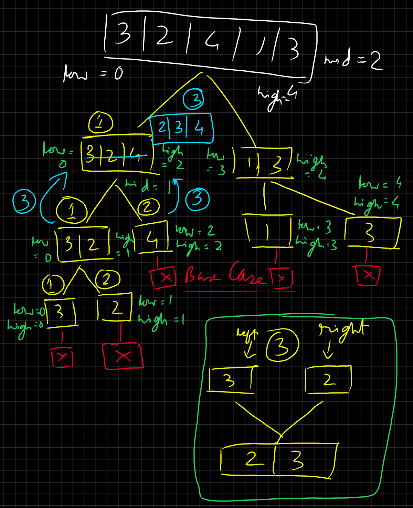

To clone this repository, run:

```bash
git clone https://github.com/sayande717/code.git
```

## TIL (Today I Learnt):
- `char *arr = (char *)malloc(sizeof(char)*cols)`: Dynamically allocate memory for a 1D array of size `cols`.
- `int **arr = (int **)malloc(sizeof(int *)*cols)`: Dynamically allocate memory for a 1D pointer array of size `cols`.
- `int *arr = (int *)calloc(cols,sizeof(int))`: Dynamically allocate memory for a 1D array of size `cols`, then fill all spaces with `0`.
- `(current + 1) % n` leads us to the next index, after current element.
- `(current + (n-1)) % n` leads us to the previous index, before current element.
- Language: `c`:
    - `EXIT_SUCCESS` means 0 and `EXIT_FAILURE` means 1 in general context, in a program. They are a part of `<stdlib.h>`.
    - `exit(EXIT_FAILURE)` and `exit(EXIT_SUCCESS)` is used to indicate failed and succesful program termination.
    - `return EXIT_SUCCESS` and `return EXIT_FAILURE` can also be used in int main() { ... } or even in other programs.
    - `printf("%.Nf"): Print N characters after the decimel point`.
    - `string` operations
        - `atoi()`: Converts a string to an integer.
            - `"123456" -> 123456
            - `"123abc123" -> 123 (converts till 1st non-number character is encountered).
    - `srand(time(NULL))`: Seeds the random number generator with the current time in seconds since EPOCH.
    - `rand()` i.e. generate random number within num: rand()%(num+1)
    - `rand()` i.e. generate random number between low and high: rand()%(high-low-1)+low
    - To calculate Execution time for a section of code:
        ```c
        #include<time.h>
        int main() {
            clock_t start, end;
            double time_used;

            start = clock();
            // Code Section
            end = clock();
            
            time_used = ((double)(end-start))/CLOCKS_PER_SEC;
            printf("Time Taken: %f",time_used);
        }
        ```
- To multiply 2 matrices:
    ```c
    for(iter0 = 0 to number of rows in Matrix 1, iter0++) {
        for(iter1 = 0 to number of columns in Matrix 2, iter1++) {
            for(iter2 = 0 to number of rows in Matrix 2, iter2++) {
                // outArr[i][k] += inArr[i][k] * inArr[k][j]
                outArr[iter0][iter1] = outArr[iter0][iter1] + (inArr1[iter0][iter2] * inArr2[iter2][iter1]);
            }
        }
    }
    ```
- To read from a file, which contains a `rows x cols` matrix:
```c
    void readText(char *filename, int **matrix, int rows, int cols) {
        FILE *file = fopen(filename, "r");
        if (file == NULL) {
            perror("Error opening file");
            exit(EXIT_FAILURE);
        }
    
        for (int row = 0; row < rows; row++) {
            for (int col = 0; col < cols; col++) {
                fscanf(file, "%d", &matrix[row][col]);
            }
        }

        fclose(file);
    }
```
- To write to a file, which contains a `rows x cols` matrix:
```c
    void writeText(char *filename, int **matrix, int rows, int cols) {
        FILE *file = fopen(filename, "w"); 
        if (file == NULL) {
            perror("Error opening file");
            exit(EXIT_FAILURE);
        }
    
        for (int row = 0; row < rows; row++) {
            for (int col = 0; col < cols; col++) {
                fprintf(file, "%d ", matrix[row][col]);
            }
            fprintf(file, "\n");
        }

        fclose(file);
    }
```
- File Opening modes:
    - “r”: Open a file for reading. The file must exist.
    - “w”: Open a file for writing. Creates a new file or truncates an existing file.
    - “a”: Open a file for appending. Writes data at the end of the file. Creates the file if it does not exist.
    - “r+”: Open a file for both reading and writing. The file must exist.
    - “w+”: Open a file for both reading and writing. Creates a new file or truncates an existing file.
    - “a+”: Open a file for both reading and appending. Creates the file if it does not exist.
- Language: `java`:
    - If input = `4 -2 3 1 6` & we're supposed to find the array length, and iterate over the integers:
        ```java
        String inputStr = "4 -2 3 1 6";
        String[] stringArr = inputStr.split(" "); // Split the string tokens into a character array, with " " as delimiter.
        stringArrLen = stringArr.length; // Length of the resultant string array.
        for(int index = 0;index++) {
            int temp = Integer.parseInt(stringArr[index]); // Convert from character to integer.
        }
        ```
    - This is how you catch the exception `NumberFormatException` when parsing a character to an integer:
        ```java
        String[] array = {'1','2','-1','a','z'};
        try {
            for(int index=0;index<array.length;index++) {
                int element = Integer.parseInt(array[index]);
            }
        } catch(Exception e) {
            System.out.print("Type of exception: "+e.getMessage);
        }
        ```
- Language: `python`:
    - This is how you catch the exception `NumberFormatException` when parsing a character to an integer:
    ```python
    arr = ['1','2','3','4','a','3','b']
    try:
        for index in range(len(arr)):
            int element = int(arr[index])
            print(f"Element at index ${index}: ${element} ")
    except ValueError: # `except ValueError as e:`, if you want to print the exception `e`
        print("Exception: ",e)
    # Rest of the code 
    ```

- Data Structures:
    - `Array`:
        - 1-Dimensional: [code]()
        - 2-Dimensional: [code](./platform/College-1/computer-architecture-and-organisation/2-d.c) 
    - `Stack`: [code]() 
    - `Queue`: [code]()
        - `Linear`: [code]()
        - `Circular`: [code]()
    - `Linked List` 
        - `Linear`: [code]()
        - `Circular`: [code](./platform/College-1/data-structure-and-algorithms/3-8.c) 

## Notes
|ID| **Name** | **Notes** | **References** | **Progress** | **Status** |
|:--- | :---: | :---: | :---: | :---: | :---: |
|0| Theory | [Markdown](./notes/Theory.md) | null | null | `In Progress` |
|1| Languages/C++ | [Markdown](./notes/Languages.md#c++) | [FreeCodeCamp](https://youtu.be/8jLOx1hD3_o) | till 06:33:26 | `In Progress` |5|2| Languages/Java | null | [FreeCodeCamp](https://www.youtube.com/watch?v=2ZLl8GAk1X4&pp=ygUeZnJlZSBjb2RlIGNhbXAgZnVsbCBkc2EgY291cnNl) | till 10:05:10 | `In Progress` |
|2| Languages/Java | null | [FreeCodeCamp](https://www.youtube.com/watch?v=2ZLl8GAk1X4&pp=ygUeZnJlZSBjb2RlIGNhbXAgZnVsbCBkc2EgY291cnNl) | till 10:55:57, 23:26:00-24:51:38 | `In Progress` |
|3| Languages/Go | null | null | null | `Suspended` |
|4| Platform/LeetCode | [Markdown](./platform/LeetCode/README.md) | null | [link](#platform-leetcode)  |`In Progress` |
|5| Platform/GeeksForGeeks | [Markdown](./platform/GeeksForGeeks/README.md) | null | [link](#platform-geeksforgeeks)  |`In Progress` |
|-1| Platform/Internship/Pinnacle Labs | null | 1/3 | null |`In Progress` |
|6| Platform/College-1 | [Computer Architecture and Organisation](./platform/College-1/computer-architecture-and-organisation/README.md) <hr> [Data Structures and Algorithms](./platform/College-1/data-structure-and-algorithms/README.md) <hr> [Design and Analysis of Algorithms](./platform/College-1/design-and-analysis-of-algorithms/README.md) <hr> [Operating Systems](./platform/College-1/operating-systems/README.md) | null | [link]()  |`In Progress` |

## Self
### \[Syntax\] Name of programming language:
1. [title.ext](/path/to/title.ext) | `Data Structure 1` `Data Structure 2`
    - Description
    - Important Takeaways
### Data Structures
> [Notes](https://github.com/sayande717/notes/blob/main/topics/Data-Structures.md) (in notes repository)

### C
1. [initSinglyLinkedList.c](./self/C/initSinglyLinkedList.c)
    - Initialize a singly linked list.
    - Add to the beginning, middle, and end of a linked list.
    - Delete from the beginning, middle and end of a linked list.
1. [linearSentinelSearch.c](./self/C/linearSentinelSearch.c)
    - Perform a Linear Sentinel Search on 10 elements.
    - In traditional Linear Search, we have to reach if we've reached the end of the array after each iteration. This is an optimised version of Linear Search, where we don't have to make that check after every iteration.
    - Sentinel search is an optimized version of linear search where a sentinel element is added at the end of the array, eliminating the need for an explicit check for the end of the array after each iteration.
1. [interpolationSearch.c](./self/C/interpolationSearch.c)
    - Perform a Interpolation Search on 10 elements.
        - Formula: 
            $$ \text{index} = \text{lo} + \left( \frac{(target - \text{arr[lo]}) \times (\text{hi} - \text{lo})}{\text{arr[hi]} - \text{arr[lo]}} \right) $$
        - We use the formula to estimate the position of the target value.
        - If `array[index]<target`, we set pointer `low` to `index+1`.
        - If `array[index]>target`, we set pointer `high` to `index-1`.
        - If `array[index]=target`, we return `pos`.
1. [exponentialSearch.c](./self/C/exponentialSearch.c)
    - Perform Exponential Search on 10 elements.
1. [mergeSort.c](./self/C/mergeSort.c)
    - Perform Merge sort on a character array.
    - Merge sort follows the Divide & Conquer approach
        - First, we (hypothetically) divide the array. We do it till it turns into n arrays, of 1 elements each.
        - Then, we compare 2 arrays each, and merge both back.
        - Further explanation has been provided in the code.
        - Diagrams:
            <br>
            <br>
1. [initBinaryTree.c](./self/C/initBinaryTree.c)
    - Initialize a Binary Tree.
    - Perform the following types of traversals on it (Recursive & Iterative):
        - Preorder
        - Inorder
        - Postorder

### C++
> [Notes](./notes/Languages.md#c++)

1. [hello.cpp](./self/C++/hello.cpp)
    - Hello, World!
    - Why `return 0`?
1. [add.cpp](./self/C++/add.cpp)
    - Add 2 numbers using function
    - Use both function and direct assignment to add 2 numbers.
1. [input.cpp](./self/C++/input.cpp)
    - Take input & print output
    - Input Stream: std::cin, std::getline(std::cin,string)
    - Output Streams: std::cout, std::cerr, std::clog
    - Data Type: std::string
1. [numbersystems.cpp](./self/C++/numbersystems.cpp)
    - Represent the number systems in C++
    - Number Systems: `Binary` `Octal` `Decimel` `Hexadecimel`
1. [initVariables.cpp](./self/C++/initVariables.cpp)
    - Different ways of initializing integers
        - When implicit conversion occurs
        - Variable modifiers: signed, unsigned, short, long
    - sizeof(): Find the size of different variables
    - Different ways of initializing fractional numbers
        - Set number precision for output screen
        - Infinity (1.5/0), NaN (0.0/0.0)
    - Initializing boolean values
    - Initializing characters
        - ASCII notation of characters
        - static_cast<int>('c')
    - Initializing variables without data types (`auto`)
1. [operationsData.cpp](./self/C++/operationsData.cpp)
    - [Full list](https://en.cppreference.com/w/cpp/language/operator_precedence)
    - Basic: +,-,*,/,%
    - Increment: ++ | Decrement: --
    - Compound Assignment: +=, -=, *=, /=, %=
    - Relational: <,<=,>,>=,==,!=
    - Logical: &&,||,!
1. [formatOutput.cpp](./self/C++/formatOutput.cpp)
    - [Full list](https://en.cppreference.com/w/cpp/io/manip)
    - Header files: `ios`, `iomanip`
    - Formatting the output
    - Formatters: `std::endl`, `std::fixed`, `std::setprecision(50)`
1. [regex.cpp](./self/C++/regex.cpp)
    - Initialize a regex pattern.
    - Perform pattern matching using regex.
1. [vector.cpp](./self/C++/vector.cpp)
    - Initialize vectors.
    - Data Types: Integer, String

### Java
<!-- > [Notes](./notes/Languages.md#java) -->

1. [initArray.java](./self/Java/initArray.java) | `Array`
    - Get started with arrays.
1. [rmIntegersFromArray.java](./self/Java/rmIntegersFromArray.java) | `Array`
    - Remove integers from the array.
1. [reverseArray.java](./self/Java/reverseArray.java) | `Array`
    - Directly print array in reverse.
    - Reverse the array in-place.
1. [findMinInArray.java](./self/Java/findMinInArray.java) | `Array`
    - Find the minimum value in the array.
1. [findSecondMaxInArray.java](./self/Java/findSecondMaxInArray.java) | `Array`
    - Find the 2nd maximum value in the array.
1. [mvZeroArray.java](./self/Java/mvZeroArray.java) | `Array`
    - Move all zeroes to the end of the array.
1. [findMissing.java](./self/Java/findMissing.java) | `Array`
    - Given an array of $n-1$ distinct numbers in the range $1$ to $n-1$, find the missing number.
    - Time constraint: $O(n)$
    - Using formula: Sum of 1st n natural numbers = $n(n+1)/2$
1. [palindromeString.java](./self/Java/palindromeString.java) | `String`
    - Check if a string is palindrome or not.
    - A palindrome string is one which remains same even when reversed.
1. [initSinglyLinkedList.java](./self/Java/initSinglyLinkedList.java) | `Linked List`
    - Create a singly linked list. 
    - Print the node values.
    - Add a node to beginning of the linked list.
1. [modify2SinglyLinkedLists.java](./self/Java/modify2SinglyLinkedLists.java) | `Linked List`
    - Add to the beginning of a linked list.
    - Add to the end of a linked list.
    - Add to a particular position in a linked list.
    - Delete the head node.
    - Delete the tail node.
    - Delete the node at a particular position.
    - Search for an element in a linked list, and return it's position.
    - Reverse the linked list.
    - Remove duplicates from linked list.
    - Return the nth number from the end.
    - Insert an element in a sorted linked list.
    - Delete an element from a linked list.
    - Detect a loop in a linked list.
    - Detect the starting point of a loop.
    - Break the loop.
1. [modify2SinglyLinkedList.java](./self/Java/modify2SinglyLinkedList2.java) | `Linked List`
    - Operations on 2 Singly Linked Lists
    - Merge 2 sorted linked lists
    - Add 2 sorted linked Lists
1. [initDoublyLinkedList.java](./self/Java/initDoublyLinkedList.java) | `Linked List`
    - Initialize a Doubly Linked List
    - Initialize functions to print the length of the Linked List, and check if it is empty.
    - Print the list forwards, and backwards.
    - Insert a node at the beginning and end of the linked list.
    - Delete the first and last node of the linked list.
1. [initSearch.java](./self/java/initSearch.java)
    - Linear Search
    - Binary Search
1. [initSort.java](./self/java/initSort.java)
    - Bubble Sort

### Go
<!-- > [Notes](./notes/Languages.md#go) -->
1. [booking-app](./self/Go/booking-app/main.go)
    - Initialize Go project with `go mod init booking-app`
    - Main file: `main.go`
    - Variables, Constants, printing them.
    - Mininal variable definition
    - Defining variables without value (value will be added later)
    - Data type
    - Formatters:
        - %v: value
        - %T: data type 
    - Taking user input
    - Initializing Arrays, Performing operations on them
    - Using `len()` to find length
    - Initializing Slices
    - Using `strings.Fields(str)`


> In case you can't access the link, the **Problem Description** has been provided in the respective **Intuition** part.

<center>

| Question | Intuition | Difficulty | Solution | Time Taken [MM:SS] |
| :---: | :---: | :---: | :---: | :---: |
| [387](https://leetcode.com/problems/first-unique-character-in-a-string/description/) | [show](./platform/leetcode/README.md#387)| Easy | [Java](./platform/leetcode/code/1.java) | Not recorded |
| [26](https://leetcode.com/problems/remove-duplicates-from-sorted-array/description/) | [show](./platform/leetcode/README.md#26) | Easy | [Java](./platform/leetcode/code/2.java) | Not recorded |
| [121](https://leetcode.com/problems/best-time-to-buy-and-sell-stock/description/) | [show](./platform/leetcode/README.md#121) | Easy | [Java](./platform/leetcode/code/3.java) | Not recorded |
| [1281](https://leetcode.com/problems/subtract-the-product-and-sum-of-digits-of-an-integer/) | [show](./platform/leetcode/README.md#1281) | Easy | [C++](./platform/leetcode/code/4.cpp) | Not recorded |
| [976](https://leetcode.com/problems/largest-perimeter-triangle/) | [show](./platform/leetcode/README.md#976) | Easy | [C++](./platform/leetcode/code/5.cpp) | Not recorded |
| [1779](https://leetcode.com/problems/find-nearest-point-that-has-the-same-x-or-y-coordinate/) | [show](./platform/leetcode/README.md#1779) | Easy | [C++](./platform/leetcode/code/6.cpp) | Not recorded |
| [1822](https://leetcode.com/problems/sign-of-the-product-of-an-array/) | [show](./platform/leetcode/README.md#1822) | Easy | [C++](./platform/leetcode/code/7.cpp) | Not recorded |
| [1502](https://leetcode.com/problems/can-make-arithmetic-progression-from-sequence/) | [show](./platform/leetcode/README.md#1502) | Easy | [Python](./platform/leetcode/code/8.py) | Not recorded |
| [1295](https://leetcode.com/problems/find-numbers-with-even-number-of-digits/) | [show](./platform/leetcode/README.md#1295) | Easy | [Java](./platform/leetcode/code/9.java) | Not recorded |
| [1672](https://leetcode.com/problems/richest-customer-wealth/) | [show](./platform/leetcode/README.md#1672) | Easy | [Java](./platform/leetcode/code/10.java) | Not recorded |
| [1](https://leetcode.com/problems/two-sum/) | [show](./platform/leetcode/README.md#1) | Easy | [Java](./platform/leetcode/code/11.java) | Not recorded |
| [9](https://leetcode.com/problems/palindrome-number/) | [show](./platform/leetcode/README.md#9) | Easy | [Java](./platform/leetcode/code/12.java) | Not recorded |
| [26](https://leetcode.com/problems/remove-duplicates-from-sorted-array/) | [show](./platform/leetcode/README.md#26) | Easy | [Java](./platform/leetcode/code/13.java) | Not recorded |
| [605](https://leetcode.com/problems/place-flowers/) | [show](./platform/leetcode/README.md#605) | Easy | [Java](./platform/leetcode/code/14.java) | 17:00 |
| [20](https://leetcode.com/problems/valid-parentheses/) | [show](./platform/leetcode/README.md#20) | Easy | [Java](./platform/leetcode/code/15.java) | Not recorded |
| [21](https://leetcode.com/problems/merge-two-sorted-lists/) | [show](./platform/leetcode/README.md#21) | Easy | [Java](./platform/leetcode/code/16.java) | Not recorded |
| [744](https://leetcode.com/problems/find-smallest-letter-greater-than-target/) | [show](./platform/leetcode/README.md#744) | Easy | [Java](./platform/leetcode/code/17.java) | Not recorded |
| [83](https://leetcode.com/problems/remove-duplicates-from-sorted-list/) | [show](./platform/leetcode/README.md#83) | Easy | [Java](./platform/leetcode/code/32.java) | 26:00 |
| [35](https://leetcode.com/problems/search-insert-position/) | [show](./platform/leetcode/README.md#35) | Easy | [Java](./platform/leetcode/code/33.java) | 21:00 |

</center>

## Platform/LeetCode
> Not started

## Platform/Internship
### Pinnacle Labs
1. [basic-calculator](./platform/Internship/Pinnacle Labs/basicCalculator.cpp)
    - Headers: `iostream` `regex` `string` `vector`.
    - Data Types: `character vector` `integer vector`.
    - Insert value into vectors, after they match with an expression.
    - Define a REGEX pattern, iterate over the REGEX pattern .
    - Type convert to integer, using `static_cast`.

1. [quiz](./platform/Internship/Pinnacle Labs/quiz.cpp)
    - Headers: `iostream` `future` `string` `iterator` `chrono` `map` `ctdlib` `vector`.
    - Data Types: `std::string array[]` `<std::string:std::string> map`.
    - Define a `<std::string:std::string> map`, iterate over the map, return it's key and value.
    - Return a `std::string array` from a function, using pointers.
    - Use `rand()` to generate random integers.

## Platform/College-1
### Computer Architecture and Organisation
<ol type="1">
    <li> Write an OpenMP Program to:
        <ol type="a">
            <li> Print "Hello World" in multiple threads.
                <ul>
                    <li> `#pragma omp parallel { ... }`: This fundamental construct starts parallel execution. </li>
                </ul>
            </li>
            <li> Find number of threads running currently. </li>
                <ul>
                    <li> `omp_get_num_threads()` -> int: This routine returns the number of threads in the current team. </li>
                </ul>
            <li> Find maximum number of threads. </li>
                <ul>
                    <li> `omp_get_max_threads()` -> int: This routine returns the maximum number of threads available in the system. </li>
                </ul>
            <li> Find the Thread ID. </li>
                <ul>
                    <li> `omp_get_thread_num()` -> int: This routine returns the thread number (ID) of the currently running thread. </li>
                </ul>            
            <li> Find the number of processor cores in the system. </li>
                <ul>
                    <li> `omp_get_num_procs()` -> int: This routine returns the number of processor cores available to the program. </li>
                </ul>
            <li> Set the number of threads to be executed. </li>
                <ul>
                    <li> `omp_set_num_threads(numberOfThreads)` -> boolean: This routine sets the number of threads to be executed within the parallel scope of the program. </li>
                </ul>
            <li> Test `is_parallel` function. </li>
                <ul>
                    <li> `omp_in_parallel()` -> boolean: This routine returns `true` if the call to the routine is enclosed by an active parallel region; otherwise, it returns `false`. </li>
                </ul>
            <li> Parallelize a simple `for` loop. </li>
                <ul>
                    <li> `#pragma omp parallel for`: The parallel loop construct is a shortcut for specifying a parallel construct containing one or more associated loops and no other statements. </li>
                </ul>          
        </ol>
    </li>
    <li> Write an OpenMP Program to:
        <ol type="a">
            <li> To perform the transpose of the matrix using parallel constructs and compare parallel and serial time. </li>
                <ul>
                    <li> If input matrix is m x n, the resultant matrix becomes n x m. </li>
                </ul> 
            <li> To perform the addition of two matrix using parallel constructs and compare parallel and serial time. </li>
            <li> To perform the multiplication of two matrix using parallel constructs and compare parallel and serial time. </li>
            <li> Parallelize the Jacobi Method. Analyze the speedup and efficiency of the parallelized code. Vary the size of your A matrix and measure the runtime with one thread. For each matrix size, change the number of threads from 2,4,8, ... and plot the speedup versus the number of threads. Compute the efficiency. Explain whether or not the scaling behavior is as expected. </li>
        </ol>
    </li>
    <li> Write an OpenMP Program:
        <ol type="a">
            <li> Using dynamic memory allocation, to print the sum of elements of an array using reduction clause.
                <ul>
                    <li> # pragma omp parallel for reduction(+:sum) if (parallelize): Perform reduction on the variable `sum` only if (parallelize) is 1/true. </li>
                </ul>
            <li> Find sum of squares of first hundred natural numbers see that half computation is done by one core and another half is computed by another core. Finally, results of computations are added and the final result is to be printed in master thread. </li>
            <li> Find the largest of a three numbers and smallest of three numbers using sections directive. </li>
            <li> Show data environmental clauses variable scope using one dimensional array addition (private, first private, Last private and Shared).
                <ul>
                    <li> Shared: `arr`, the array itself. </li>
                    <li> Private: `index`, to prevent data race when incrementing it's value. </li>
                    <li> FirstPrivate: `sum` & `size`, so we can get their initial values. </li>
                    <li> LastPrivate: `sum`, so we can get the final sum of all elements. </li>
                </ul>
            </li>
            <li> Perform the transpose of the matrix using parallel for loop constructs with different scheduling clause and compare parallel and serial execution time. </li>
            <li> Perform matrix addition and subtractions of above 1024 x 1024 size.
                <ul>
                    <li> Use files concept for input and output. </li>
                    <li> Test for various scheduling clauses. </li>
                    <li> Compute serial program execution time and parallel program execution time. </li>
                </ul>
            </li>
        </ol>
    </li>
</ol>

### Data Structures and Algorithms 
<ol type="1">
    <li> Data Structure: <strong> Array </strong>:
        <ol type="a">
            <li> 1-1.c: Accept the age of `n` employees and search for a particular age using `Sentinel search`. </li>
            <li> 1-2.c: In an array, accept age of `n` students. Only display those numbers that are perfect. A perfect number is equal to the sum of its proper divisors. </li>
            <li> 1-3.c: Accept your name and reverse it using a `recursive function` (without using a built-in function). Display the reversed name in the main module. </li>
        </ol>
    </li>
    <li> Data Structure: <strong>Stack</strong>:
        <ol type="a">
            <li> 2-1.c: Accept your name and perform stack operations on it. 
                <ul>
                    <li> To take limited number of strings as input in C (example 5), `scanf("%5s",&inStr);`. </li>
                </ul>
            </li>
            <li> 2-2.c: Accept any decimel number and convert to binary using stack. </li>
            <li> 2-3.c: Accept any arithmetic expression and covert to postfix using stack. </li>
        </ol>
    </li>
    <li> Data Structure: <strong>Queue</strong>
        <ol type="a">
            <li> 2-4.c: Perform linear queue operations on the height of N students. </li>
            <li> 2-5.c: Accept N patients token no and perform circular queue operations.
                <ul>
                    <li> `(rear+1)%n` calculates the next position after rear. </li>
                    <li> `(rear+(n-1))%n` calculates the previous position before rear. </li>
                    <li> In a circular queue, rear can be at any position, due to which we cannot check for the condition `rear==(queue.length-1)`. </li>
                </ul>
            </li>
        </ol>
    </li>
    <li> Data Structure: <strong> Linked List </strong>
        <ol type="a">
            <li> 3-1.c: Create a linked list to accept n students name and reg.no. Display the details  of all students </li>
            <li> 3-2.c: Perform the stack operations on a single linked list of n employees such as employee no and salary. If salary is >3000 then pop from the linked stack. </li>
            <li> 3-3.c: Perform Queue operations on a single linked list of in-patient records such as patient name, hospital no and date of admission. Assume patient is allowed to stay for 3 days only. After that patient to be discharged. In other words the patient details to be removed from the queue. </li>
            <li> 3-4.c: Create a single linked list to accept cricket players details such as name, age,  run score with overs completed. After creating a players  list check if a player scored runs 50 and above in 8 overs then remove that player and add it in the middle. If a player scored 80 runs between 15 and 20 overs, then remove that player and add at the beginning. If a player scored zero runs irrespective of overs then add at the last. Display the players list after each operation. <\li>
            <li> 3-5.c: Accept any arithmetic expression in infix form. Using stack convert to its prefix notation and display the same. </li>
            <li> 3-6.c: Perform the operations of a queue in a circular fashion for customers who are visiting the gym. </li>
            <li> 3-7.c: Accept two polynomials of various degrees. Find the sum of these polynomials using linked list and display the result in polynomial form. </li>
            <li> 3-8.c: Create a circular linked list to accept student information such as register number, name and age. Add new student information at the last and remove nth student information from the circular list. Display the circular list after performing each operation. </li>
            <li> 3-9.c: Build a single linked list to accept any two polynomials of various degree. Find the difference between those two polynomials and display the result in a polynomial representation. </li>
        </ol>
    </li>
    <li> Algorithm: <strong> Searching </strong>
        <ol type="a">
            <li> 4-1.c: Exponential & Interpolation Search </li>
            <li> 4-2.c: Accept any two polynomials of various degrees. Find the sum of those two polynomials using linked list and display the result in polynomial form. </li>
        </ol>
    </li>
    <li> Algorithm: <strong> Sorting </strong>
        <ol type="a">
            <li> 5-1.c: Merge Sort: Accept your name and sort your name using mergesort. Display your name and the sorted order of your name. </li>
        </ol>
    </li>
</ol>

### Design and Analysis of Algorithms
<ol type="1">
    <li> 1-1.c: You are given an undirected graph. The task is to assign colors to each vertex of the graph such that no two adjacent vertices share the same color, using the minimum number of colors. Implement the greedy coloring algorithm to solve this problem.
        <br>
    </li>
    <li> 1-2.c: You are given n jobs. Each job $J_i$ has a deadline $d_i$ and a profit $p_i$. Only one job can be scheduled at a time. The task is to find the sequence of jobs that maximizes the total profit while ensuring that no job is scheduled after its deadline.
        <table>
            <tr>
                <th>S. No.</th>
                <th>Jobs</th>
                <th>Deadlines</th>
                <th>Profits</th>
            </tr>
            <tr>
                <td>1</td>
                <td>J1</td>
                <td>2</td>
                <td>20</td>
            </tr>
            <tr>
                <td>2</td>
                <td>J2</td>
                <td>2</td>
                <td>70</td>
            </tr>
            <tr>
                <td>3</td>
                <td>J3</td>
                <td>1</td>
                <td>40</td>
            </tr>
            <tr>
                <td>4</td>
                <td>J4</td>
                <td>4</td>
                <td>110</td>
            </tr>
            <tr>
                <td>5</td>
                <td>J5</td>
                <td>5</td>
                <td>80</td>
            </tr>
        </table>
    <li> 2-1.py: Develop a Python program that use the divide and conquer technique to address the Domino Tiling Problem. Outline the process used in the divide and conquer approach for this particular problem. </li>
    <li> 2-2.py: Write a Python program to multiply two large integers using Karatsuba's fast multiplication method. Your implementation should demonstrate the efficiency of Karatsuba's algorithm compared to the standard multiplication method for large numbers.
        <ol type="a">
            <li> Use the `-lm` flag for compiling code having mathematical operations like pow(), log10(), etc. </li>
            <li> If either of the numbers is single-digit, perform a simple multiplication. Otherwise, use the algorithm.
            <li> $(\log_{10} 1234+1)$ gives us the number of digits in $1234$. </li>
        </ol>
    </li>
    <li> 2-3.py: Write a Python program to multiply two 4×4 matrices using Strassen's algorithm. Your program should be efficient and demonstrate the recursive nature of the algorithm. </li>
    <li> 2-4.py: You are given a sequence of matrices, and you need to determine the most efficient way to multiply these matrices together. Write a Python program that computes the minimum number of scalar multiplications needed to multiply the given chain of matrices using dynamic Programming. </li>
    <li> 2-5.py: You are given two sequences, and your task is to find the length of the longest subsequence that appears in both sequences. Write a Python program to compute the LCS and also to retrieve the actual subsequence.
        <ul>
            <li> Sequence names1 = ["Sachin","Virat","Dhoni","Rohit","Jadeja"] </li>
            <li> Sequence names2 = ["Virat","Sachin","Jadeja","Dhoni","Rohit"] </li>
        </ul>
    </li>
    <li> 3-1.py: Implement the Rabin-Karp algorithm to search for a given pattern in a large text string. Given a large string T of length n and a pattern P of length m, find all the starting indices where P appears as a substring in T using the Rabin-Karp algorithm. Assume that both the pattern P and the text T contain only lowercase English letters ('a' to 'z'). </li>
    <li> 3-2.py: You are given two strings: text and pattern. Your task is to find all occurrences of the pattern in the text using the Knuth-Morris-Pratt (KMP) algorithm and return the starting indices of these occurrences. </li>
    <li> 3-3.py: You are given an N×N chessboard. The objective is to place N queens on the board such that no two queens threaten each other. That is, no two queens should share the same row, column, or diagonal. </li>
    <li> 3-4.py: Given a set of integers and a target sum, determine if there is a subset of the given integers that adds up to the target sum. The solution must use backtracking to explore all possible subsets. </li>
</ol>

### Operating Systems
<ol type="1">
    <li> 1-1.md: Write 15 Linux commands and their purpose: man, --help, ls, cat, grep, mkdir, rmdir, rm, shred, cp, mv, chmod, chown, sudo, cal, date, timedatectl, dd, wc </li>
    <li> 1-2.c: OS system calls in C.
        <ol type="a">
            <li> `fork()` returns Child process ID in the forked process, and `0` in the parent process. </li>
        </ol>
    </li>
    <li> 1-3.c: Write a program to:
        <ol type="a">
            <li> Create parent & child process and print their id. </li>
            <li> Create a zombie process. </li>
            <li> Create an orphan process. </li>
        </ol>
    </li>
    <li> 1-4.c: CPU Scheduling Algorithms:
        <ol type="a">
            <li> FCFS (First Come First Serve) | Non-Preemptive </li>
            <li> SJF (Shortest Job First) & SRTF (Shortest Remaining Time First) | Preemptive & Non-Preemptive </li>
            <li> Priority | Preemptive & Non-Preemptive </li>
            <li> Round Robin | Non-Preemptive </li>
        </ol>
    </li>
    <li> 2-1.c: Process Synchronisation:
        <ol type="a">
            <li> Producer Consumer problem using Semaphore </li>
            <li> Reader Writer problem using Semaphore </li>
            <li> Dining Philosopher problem using Monitor </li>
        </ol>
    </li>
    <li> 2-2.c: Implement the Banker's Algorithm for Deadlock Avoidance. </li>
</ol>

## Platform/College-1/Litcoder
### Week 1
- Handbook: [Code Maturity](./platform/Litcoder/Week 1/Handbook.pdf)
- Case References:
    1. [Maintainability](./platform/Litcoder/Week 1/Case References/Maintainability.pdf)
    1. [Reliability](./platform/Litcoder/Week 1/Case References/Reliability.pdf)
    1. [Security](./platform/Litcoder/Week 1/Case References/Security.pdf)
    1. [Vulnerabilities](./platform/Litcoder/Week 1/Case References/Vulnerabilities.pdf)

1. Lab 1
    1. [lab1.java](./platform/Litcoder/Week 1/Code/lab1.java)
    1. [lab1.py](./platform/Litcoder/Week 1/Code/lab1.py)
    - Count the number of positive and negative numbers: You have ben provided with an array of integers. Your task is to calculate the ratios of three types of elements within the array: positive numbers, negative numbers, and zeros. For each category, determine the fraction of elements in relation to the total number of elements in the array.
    - Input:
        ```text
        6               (Size of array)
        -4 3 -9 0 4 1   (Elements in array)
        ```
    - Output:
        ```text
        - 0.500         (Ratio of positive integers)
        - 0.333         (Ratio of negative integers)
        - 0.167         (Ratio of zeroes)
        ```
1. Lab 2
    1. [lab2.java](./platform/College-1/Litcoder/Week 1/Code/lab2.java)
    1. [lab2.py](./platform/College-1/Litcoder/Week 1/Code/lab2.py)
    - Devices Count: A device manufacturer tests its devices through an operation that lasts approximately 4 hours for each device. Now, calculate the number of devices that can be tested in the given amount of time and display the remaining number of devices to be tested. If the given time is less than the operation period of 4 print “Invalid Input”.
    - Input:
        ```text
        12              (Number of hours available)
        70              (Number of devices to be tested)
        ```
    - Output:
        ```text
        3               (Number of devices that could be tested)
        67              (Remaining number of devices left to be tested)
        ```
    - Input:
        ```text
        3
        10
        ```
    - Output:
        ```text
        Invalid Input   (Number of hours available < 4)
        ```
1. Lab 3
    1. [lab3.java](./platform/College-1/Litcoder/Week 1/Code/lab3.java)
    1. [lab3.py](./platform/College-1/Litcoder/Week 1/Code/lab3.py)
    - Given an array of positive and negative integers, write a program to determine if there exists a subarray with a sum equal to zero. If a subarray with a sum equal to zero is found, print "True," otherwise print "False."
    - Constraints:
        - The size of the array (N) is between 1 and 10. If it does NOT meet this condition, print “Array size must be between 1 and 10”.
        - Each element in the array is between -10 and 10. If it does NOT meet this condition, print "Array elements must be from -10 to 10".
        - The array can contain only both positive and negative integers. If it does NOT meet this condition, print “Array elements must be integers”.
        - The elements of the array are integers.
    - Input:
        ```text
        4 -2 3 1 6     (Elements in array)
        ```
    - Output:
        ```text
        False          (Subarray doesn't exist)
        5              (Number of elements in array)
        ```
    - Input:
        ```text
        1 -2 3 4 -5 6 7 -8 9 -10 11 -12 13 -14 15 
        ```
    - Output:
        ```text
        Array size must be between 1 and 10
        ```
