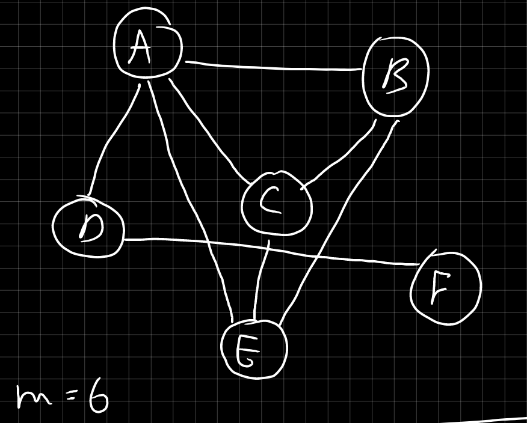

<ol type="1">
    <li> 1-1.c: You are given an undirected graph. The task is to assign colors to each vertex of the graph such that no two adjacent vertices share the same color, using the minimum number of colors. Implement the greedy coloring algorithm to solve this problem.
         
    </li>
    <li> 1-2.c: You are given n jobs. Each job $J_i$ has a deadline $d_i$ and a profit $p_i$. Only one job can be scheduled at a time. The task is to find the sequence of jobs that maximizes the total profit while ensuring that no job is scheduled after its deadline.
        <table>
            <tr>
                <th>S. No.</th>
                <th>Jobs</th>
                <th>Deadlines</th>
                <th>Profits</th>
            </tr>
            <tr>
                <td>1</td>
                <td>J1</td>
                <td>2</td>
                <td>20</td>
            </tr>
            <tr>
                <td>2</td>
                <td>J2</td>
                <td>2</td>
                <td>70</td>
            </tr>
            <tr>
                <td>3</td>
                <td>J3</td>
                <td>1</td>
                <td>40</td>
            </tr>
            <tr>
                <td>4</td>
                <td>J4</td>
                <td>4</td>
                <td>110</td>
            </tr>
            <tr>
                <td>5</td>
                <td>J5</td>
                <td>5</td>
                <td>80</td>
            </tr>
        </table>
    <li> 2-1.c: Program for Karatsuba Multiplication Algorithm.
        <ol type="a">
            <li> If either of the numbers is single-digit, perform a simple multiplication. Otherwise, use the algorithm.
            <li> $(\log_{10} 1234+1)$ gives us the number of digits in $1234$. </li>
        </ol>
    </li>
    <li> 2-2.c: Program for Strassen's Multiplication Algorithm.
</ol>
