Commands: man, --help, ls, cat, grep, mkdir, rmdir, rm, shred, cp, mv, chmod, chown, sudo, cal, date, timedatectl, dd, wc
# 1. man & --help

## Description
Used to get information on what a command does and how to use it.

## Syntax
```bash
$ man ls			# Show the manual page for the command.
$ ls --help		# Show information about all usable flags.
```
## Output (man)
<br>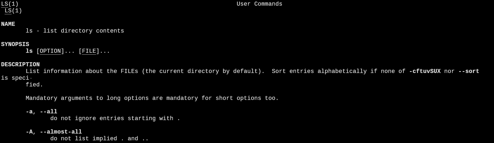

## Output (--help)
<br>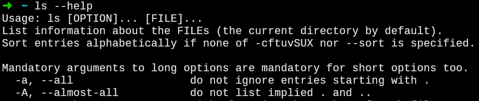

# 2. ls

## Description
Used to list files in a directory. Shows various levels of information based on the flags passed to it.

## Syntax
```bash
$ ls		# List everything except hidden files / directories.
$ ls -l	# List as above, with user permissions & file size.
$ ls -lh	# List as above, with file size in human readable format.
$ ls -lha	# List as above, also include hidden files / directories.
$ ls *	# List all directories in the current path.
```

## Output
<br>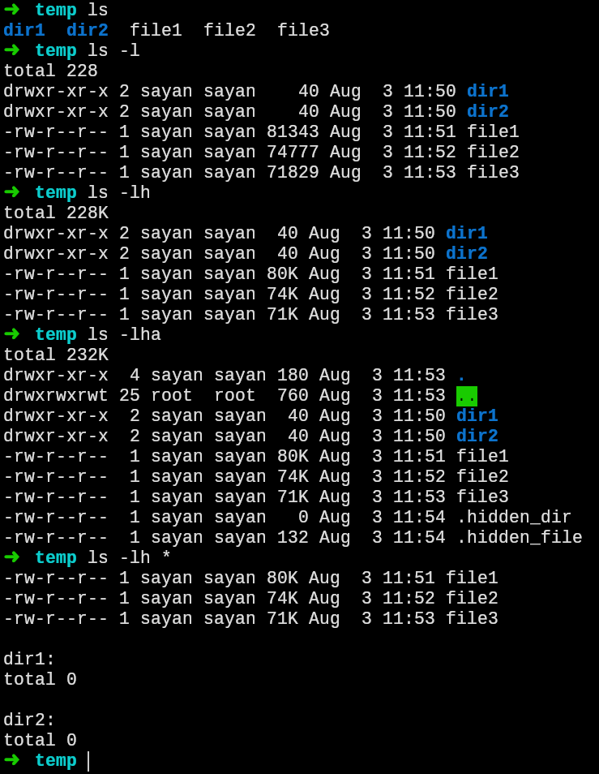

# 3. cat

## Description
Used to see the contents of a file / other readable location.

## Syntax
```bash
$ cat TempFile		# Show the contents of `TempFile`.
```

## Output
<br>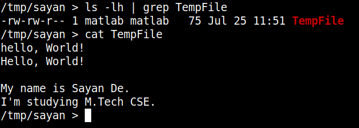

# 4. grep

## Description
Used to search for strings in a file / directory / other searchable location.

## Syntax
```bash
$ cat TempFile | grep ‘hello’	 # Search for `hello`, case sensitive.
$ cat TempFile | grep -i ‘hello’ # Search for `hello`, case insensitive.
$ ls -lha | grep ‘TempFile’ # Search for `TempFile` in the output of a command.
```

## Output
<br>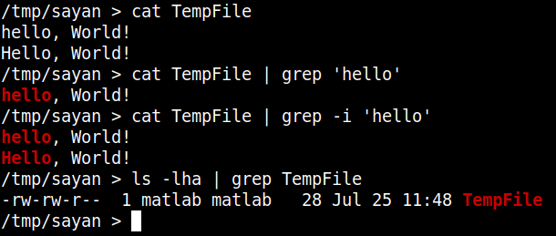

# 5. mkdir
## Description
Used to create a new directory.
## Syntax
```bash
$ mkdir TempDIR		# Create directory.
$ mkdir -v TempDIR 		# Create directory & print a message.
```

## Output
<br>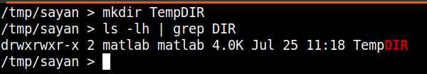

## Output
<br>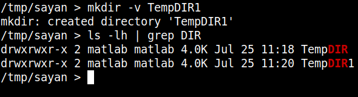

# 6. rmdir
## Description
Used to delete / remove a directory.
## Syntax
```bash
$ rmdir TempDIR		# Remove directory.
$ rmdir -v TempDIR 		# Remove directory & print a message.
```

## Output
<br>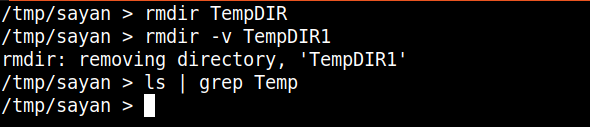

# 7. rm
## Description
Used to delete / remove a file, and a directory if the recursive (-r) flag is used.
## Syntax
```bash
$ rm TempFile				# Remove file.
$ rm -r TempDIR 			# Remove directory.
```

## Output
<br>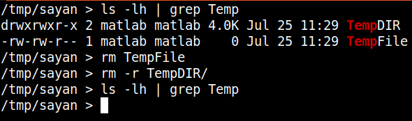

# 8. shred

## Description
Whenever a file is deleted, it is not actually deleted from disk, rather just the file system entry is deleted. The content remains available and can be recovered. The `shred` command not only deletes the file, but also overwrites the file `n` number of times with zeroes or random numbers, which makes the contents unrecoverable.

## Syntax
```bash
$ shred File		# Overwrite the file, but don’t delete it.
$ shred -u File	# Overwrite the file with 3 passes & delete it.
$ shred -n 5 -u File # Overwrite the file (5 passes) & delete it.
```

## Output
<br>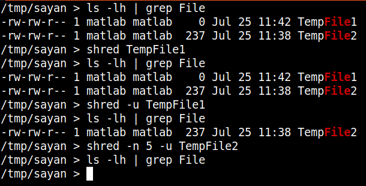

# 9. cp & mv
## Description
Used to copy & move files / directories. `cp` needs the `-r` flag to copy directories, while `mv` doesn’t. Both `cp` & `mv` can also be used to rename files / directories.

## Syntax (cp)
```bash
$ cp file1 ../dir2/				# Copy file & keep same name.
$ cp file1 ../dir2/renamed_file 	# Copy file & rename it.
$ cp -r ../dir2 .				# Copy directory.
```

## Output (cp)
<br>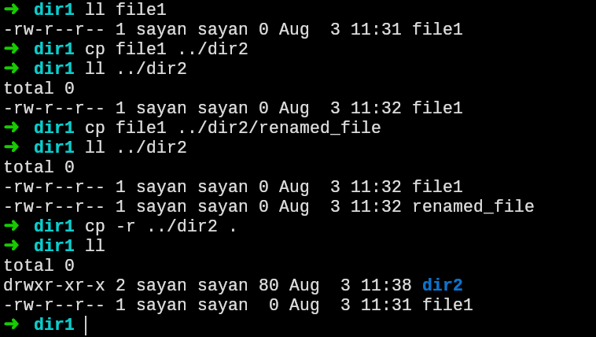

## Syntax (mv)
```bash
$ mv file1 dir1/			    	# Move file & keep same name.
$ mv file2 ../dir2/renamed_file2 	# Move file & rename it.
$ mv renamed_dir3 ../			# Move directory.
$ mv file3 renamed_file3			# Just rename the file.
$ mv dir3 renamed_dir3			# Just rename the directory.
```

## Output (mv)
<br>
<br>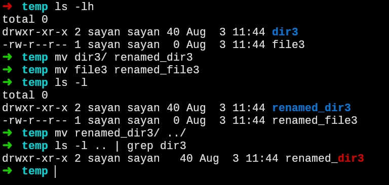

# 10. chmod & chown

## Description
Used to change the mode of a file / directory.

## Syntax
```bash
$ ls -l DIR	  # Command to demonstrate usage
drwxr-xr-x 2 sayan sayan 4.0K Jan 13 20:39 file
-                 Directory or not?
 ---        Read, write, execute permissions for Owner	    (u)
	---     Read, write, execute permissions for Group         (g)
	   ---  Read, write, execute permissions for Everyone else (o)
$ chmod g+x file	  		# Add execute permission to Group.
$ chmod o-r file  		# Remove read permission from Others.
$ chown root:root file 	# Change ownership of `file` to root.
```

## Output (chmod)
<br>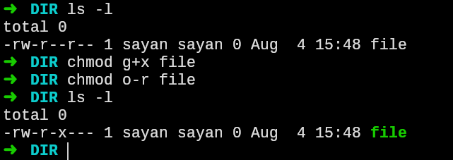

## Output (chown)
<br>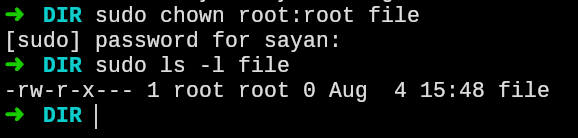

# 11. sudo
# Description
Used to run a command as root.
## Syntax
```bash
$ sudo sh script.sh	# Command to run `script.sh` as root.
```

## Output
<br>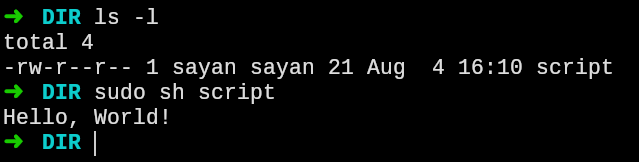

# 12. cal
## Description
Used to display a calendar on the command line.
## Syntax
```bash
$ cal	# Display the current month & current date.
$ cal -3	# Display current month, and the one before and after it.
$ cal -v  # Display weeks vertically.
$ cal -y 2000 # Display speficied year.
```

## Output
<br>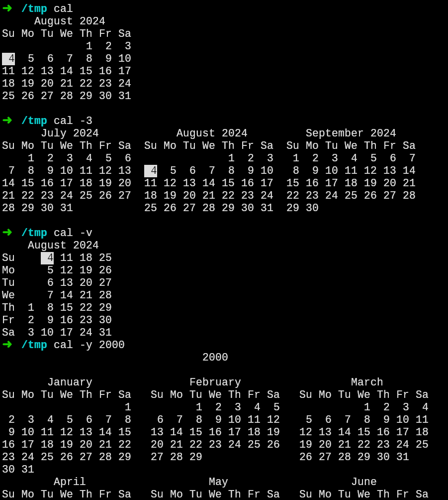

# 13. date
## Description
Used to display the date in a specified format.
## Syntax
```bash
$ date			# Display the current date.
$ date %d.%m.%y	# Display date in specified format.
```

## Output
<br>

# 14. timedatectl
## Description
Used to display & change the system time & date.
## Syntax
```bash
$ timedatectl		# Display the current time & NTP info.
$ timedatectl set-timezone Asia/Kolkata # Set timezone.
$ timedatectl set-time 00:00	# Set time to 00:00 (midnight).
```

## Output
<br>

# 15. dd
## Description: Used mainly for writing to disks.
## Syntax
```bash
$ dd if=/dev/zero of=file1 bs=1024 count=1 status=progress		
	# Create a file, write it with zeroes, show progress.
$ dd if=/dev/urandom of=file2 bs=1024 count=1 status=progress
	# Create a file, write it with randomly seeded data.
$ dd if=/dev/zero of=swapfile bs=1024 count=1024
$ swapon swapfile
	# Create a swap file (as opposed to a swap partition).
```

## Output
<br>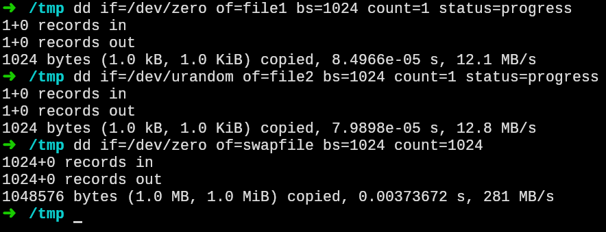

# 16. wc

## Description
Used to count number of lines, words, characters, etc. In the output. Usually used with `cat` or a live output stream.

## Syntax
```bash
$ cat temp.sh | wc -l # `-l` displays the number of lines
$ sh temp.sh | wc -c  # `-c` displays the number of characters
```
## Output
<br>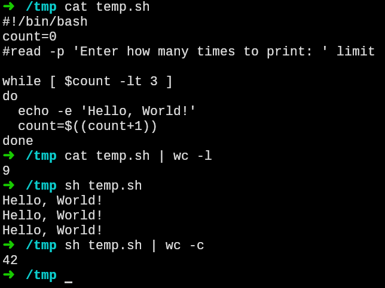
